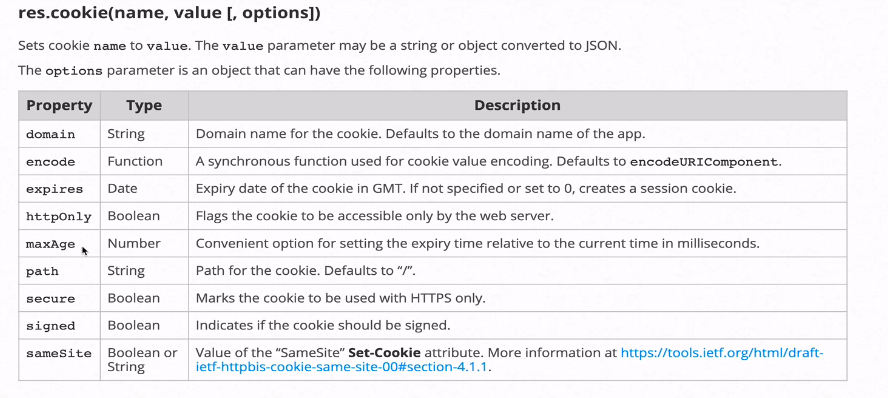
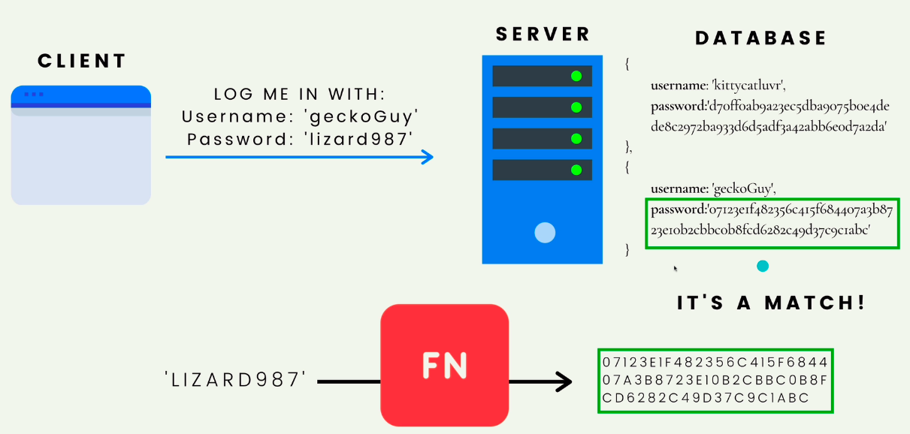

# Authentication

- [Authentication](#authentication)
  - [Cookies](#cookies)
    - [Setting a cookie in express](#setting-a-cookie-in-express)
    - [Getting a cookie](#getting-a-cookie)
    - [Signing cookies](#signing-cookies)
  - [Authentication vs Authorization](#authentication-vs-authorization)
    - [How to store passwords](#how-to-store-passwords)
      - [Salting the passwords](#salting-the-passwords)

## Cookies

- Cookies are little bits of information that are stored in a user's browser when browsing a particular website.
- Once a cookie is set a user's browser will send the cookie on every subsequent request to the site.
- Cookies allow us to make HTTP requests stateful.
- Can be used to store preferences of a user rather than having to ask the user everytime

### Setting a cookie in express

```javascript
const express = require("express");
const app = express();

app.set("/setcookie", (req, res) => {
  res.cookie("name", "chirag jain");
  res.send("sent a cookie");
});

app.listen(3000);
```

- After going to the /setcookie route a new cookie will be set as name-chirag jain and any subsequent request to the same website will send this cookie.
- Can pass in the following options with the cookie(optional)
  

### Getting a cookie

- To get a cookie need to install `cookie-parser` package

```
npm i cookie-parser
```

```javascript
const express = require("express");
const app = express();
const cookieParser = require("cookie-parser");

// middleware
app.use(cookieParser);

app.set("/getcookie", (req, res) => {
  console.log(req.cookies); // { name:'chirag jain' }
});

app.set("/setcookie", (req, res) => {
  res.cookie("name", "chirag jain");
  res.send("sent a cookie");
});

app.listen(3000);
```

### Signing cookies

- Signing something in digital terms means adding a cryptographic signature so that we can verify if it comes from the original source
- It **does not** mean encrypting the data

```javascript
const express = require("express");
const app = express();
const cookieParser = require("cookie-parser");

// the string passed will be used by cookie parser to verify
app.use(cookieParser("thisIsASecret"));

app.set("/getcookie", (req, res) => {
  console.log(req.cookies);
});

app.set("/setcookie", (req, res) => {
  res.cookie("name", "chirag jain");
  res.send("sent a cookie");
});

app.get("/setsignedcookie", (req, res) => {
  res.cookie("fruit", "grape", { signed: true });
  res.send("ok signed");
});

app.get("/getsignedcookie", (req, res) => {
  // can't get signed cookies in the normal req.cookies
  console.log(req.signedCookies);
  // {fruit : 'grape'}
});

app.listen(3000, () => {
  console.log("server running");
});
```

## Authentication vs Authorization

- **Authentication ->** the process of verifying who a particular user is ex. by using a email password combo
- **Authorization ->** What a specific user has access to. Generally, We authorize user after they have been authenticated

### How to store passwords

- **Never store passwords as plain text**
- Rather than storing a password in the database, we run the password through a **hashing function** first and then store the result in the database.
  - **Hashing Functions** -> take input data of any size and map it to fixed-size output values.
  - A small change in the input value changes the output drastically so unlikely to find two same outputs
  - It's a one way function
- When a user enters username & password we send that data to the server hash our plain text password using the same hash function compare it to the one stored in the database if same login user if false then incorrect
  

#### Salting the passwords

- A salt is a random value added to the password before we hash it.
- It ensures unique hashes since for each password if we add a random thing(salt) to it and then hash it there is no way to reverse engineer the original password say using a lookup table.
