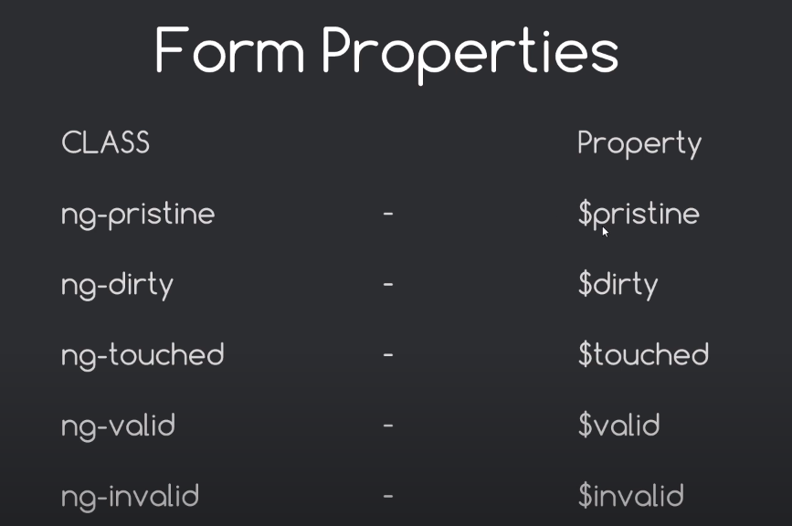

# AngularJS

Uses the MVC or the MVW(Model-View-Whatever) approach.

## MVC Architecture

- Model - The model is the data that we work with. Ex JSON, database data
- View - Used to display content and data to a user in a browser.
    - Uses expressions to insert data into views 
    - ex. `<html tag>{{data}}</html tag>`
    - This data is going to get updated dynamically
- Controller - controls the function of our views 
    - performs the interaction b/w our model and our views
    - different controllers for different areas in our application. Ex. a registration controller for registering a new user.

Example of a MVC 

The user clicks on a show users button. The 'userController' sees the click event and performs a function. The function communicates with the model and gets all the user data. The controller passes the access to this data to the view which shows it using expressions.

## 2 way data binding

Enclosing any tag with `ng-app` will let angular take control of the entire document inside the tag.

The ng-app is a directive.

Using `ng-model` directive we can provide a model to the html tag we are using.

```html
<!DOCTYPE html>
<html lang="en" ng-app>
	<head>
		<meta charset="UTF-8" />
		<meta http-equiv="X-UA-Compatible" content="IE=edge" />
		<meta name="viewport" content="width=device-width, initial-scale=1.0" />
		<link rel="stylesheet" href="./content/css/styles.css" />
        <!-- include the angular file here -->
        <!-- used the downloaded version -->
		<script src="./app/lib/angular.min.js"></script>
		<title>Angular Tutorial</title>
	</head>
	<body>
        <!-- using this ng-model the model favMeat is going to store the value of whatever is in the input field -->
		<input
			type="text"
			ng-model="favMeat"
			placeholder="Enter your favorite meat"
		/>
        <!-- the value will change dynamically depending on the input field-->
		<p>Your favorite meat is : {{favMeat}}</p>
	</body>
</html>

```

 This is called as two way since updating the view updates the model and updating the model updates the view.

## Directives & Expressions

Inside an expression we can access any data and they are basically little snippets of javascript code.

`<p>{{5 * 5}}</p>` will evaluate to 25.

`ng-init` directive will allow us to load in some data when the application loads. This is not a good practice since we generally use controllers to do something like this.

```html
<!DOCTYPE html>
<html lang="en" ng-app>
	<head>
		<meta charset="UTF-8" />
		<meta http-equiv="X-UA-Compatible" content="IE=edge" />
		<meta name="viewport" content="width=device-width, initial-scale=1.0" />
		<link rel="stylesheet" href="./content/css/styles.css" />
		<!-- include the angular file here -->
		<script src="./app/lib/angular.min.js"></script>
		<title>Angular Tutorial</title>
	</head>
	<body ng-init="numbers=[1,2,3,4]">
		<!-- using this ng-model the model favMeat is going to store the value of whatever is in the input field -->
		<input
			type="text"
			ng-model="favMeat"
			placeholder="Enter your favorite meat"
		/>
		<!-- the value will change dynamically -->
		<!-- <p>Your favorite meat is : {{favMeat}}</p> -->
		<p>{{numbers[0] + numbers[3]}}</p>
	</body>
</html>
```

Can add dynamic class values as well

```html
<body ng-init="color='orange'">
		<!-- using this ng-model the model favMeat is going to store the value of whatever is in the input field -->
    <input
           type="text"
           ng-model="favMeat"
           placeholder="Enter your favorite meat"
           />
    <p class="{{color}}">Hello there</p>
</body>
```

```css
.orange {
	color: orange;
}
```

`ng-repeat` - repeats it for the number of values.

```html
<body ng-init="numbers=[1,2,3,4]">
    <ul>
        <li ng-repeat="num in nums">{{num}}</li>
    </ul>
</body>
```

## Modules

Use modules to use javascript in code since we would need to add different controllers and other things. Basically a container for all the other components.

```javascript
----------------------------------------------app.js file-------------------------------------------------
// This module is basically the container for all the other components

// variable name does not need to be the same as module name
// need to pass the dependencies in an array
var myNinjaApp = angular.module("myNinjaApp", []);

// this config method is basically a function that will run before the application runs
// any kind of prep work is done here ex. routing
myNinjaApp.config(function () {});

// this runs while the application is running
myNinjaApp.run(function () {});

```

Also add the module to the ng-app directive

```html
<!-- this needs to be the same as the module name and not the variable name -->
<html lang="en" ng-app="myNinjaApp">
```

## Controllers

At its core controllers control the applications data.

To create a controller

```javascript
myNinjaApp.controller("NinjaController", function () {});
```

To assign it to html

```html
<div ng-controller="NinjaController"></div>
```

Can access any data from the controller using the `$scope` inside the controller and accessing using expressions in the html. Ex.

```javascript
var myNinjaApp = angular.module("myNinjaApp", []);

myNinjaApp.controller("NinjaController", function ($scope) {
    // message will be accessible to the html tag with ng-controller as NinjaController 
	$scope.message = "New message";
	$scope.ninjas = ["abc", "def", "ghi", "jkl"];
});
```

```html
<div ng-controller="NinjaController">
    {{message}}
    <ul>
        <li ng-repeat="ninja in ninjas">{{ninja}}</li>
    </ul>
</div>
```

Since we need the `$scope` variable we need to protect it from minification we can do this by putting the function and any of its dependencies inside an array.

```javascript
myNinjaApp.controller("NinjaController", [
	"$scope",
	function ($scope) {
		$scope.message = "New message";
		$scope.ninjas = ["abc", "def", "ghi", "jkl"];
	},
]);
```

We pass the dependencies like the `$scope` and the function will always be the last dependency.

## Filters

Used to format data. Can be used by addding (pipe) `|` this to the expression or to an attribute.

Ex.

```javascript
$scope.ninjas = [
    {
        name: "Yoshi",
        belt: "green",
    },
    {
        name: "Crystal",
        belt: "Yellow",
    },
    {
        name: "Ryu",
        belt: "Orange",
    },
    {
        name: "Shaun",
        belt: "black ",
    },
];
```

```html
<ul>
    <!-- will order alphabetically according to the name -->
    <li ng-repeat="ninja in ninjas | orderBy: 'name'">
        {{ninja.name}}
    </li>
</ul>
```

Adding a `-` before will filter in the opposite order.

To add more filters just add it alongside after a `|`.

Ex. using `filter` filter

```html
<div ng-controller="NinjaController">
    <input type="text" ng-model="search" />
    <ul>
        <li
            ng-repeat="ninja in ninjas | orderBy: 'name' | filter : search"
            >
            {{ninja.name}}
        </li>
    </ul>
</div>
```

The `filter` filter selects a subset of an array.

The `filter` filter can only be used on arrays, and it returns an array containing only the matching items.

Now it has filter of orderBy name alphabetically and only show those which matches the search model.

In the attribute a filter is concerned with how it is shown and in a expression it only is for that expression.

Currency filter

```html
<div ng-controller="NinjaController">
    <input type="text" ng-model="search" />
    <ul>
        <li
            ng-repeat="ninja in ninjas | orderBy: 'name' | filter : search"
            >
            {{ninja.name}} - {{ninja.rate | currency:'$'}}
        </li>
    </ul>
</div>
```

## ng-include directive

`ng-include` includes the directive from external HTML file.

External html file

```html
--------------------------------------------header.html----------------------------------------------------
<div id="menu-bar">
	<h1>Ninja Directory</h1>
	<ul>
		<li><a href="">Home</a></li>
		<li><a href="">List Ninjas</a></li>
	</ul>
</div>
```

```html
----------------------------------------------index.html---------------------------------------------------
<ng-include src="'header.html'"></ng-include>
<!-- this will get included under ng-include which will have the code inside it -->
------------------------------------------------OR---------------------------------------------------------
<header ng-include="'header.html'" ></header>
```

## ng-show and ng-hide

Using `ng-show` and `ng-hide` directives it will show or hide the element depending upon whether the attribute evaluates to true or false. 

Ex. ninjaController file two people are available and the other 2 are not

```javascript
myNinjaApp.controller("NinjaController", [
	"$scope",
	function ($scope) {
		$scope.message = "New message";
		$scope.ninjas = [
			{
				name: "Yoshi",
				belt: "green",
				rate: 50,
				available: true,
			},
			{
				name: "Crystal",
				belt: "blue",
				rate: 20,
				available: true,
			},
			{
				name: "Ryu",
				belt: "orange",
				rate: 30,
				available: false,
			},
			{
				name: "Shaun",
				belt: "black ",
				rate: 10,
				available: false,
			},
		];
	},
]);
```

Using ng-show show only those where available is true

```html
<ul>
    <li
        ng-repeat="ninja in ninjas | orderBy: 'name' | filter : search"
        style="color: {{ninja.belt}}"
        ng-show="ninja.available"
        >
        {{ninja.name}} - {{ninja.rate | currency:'$'}}
    </li>
</ul>
```

using ng-hide will hide those which evaluate to true.

## ng-click

Directive that listens to click and then respond in some way.

Ex. on clicking the buttons it sets the order value accordingly which is also used by the orderBy filter.

```html
<div ng-controller="NinjaController">
    <!-- idhar dekh order ki value change hogi onclick pe -->
    <button ng-click="order = 'name'">Order by name</button>
    <button ng-click="order = 'belt'">Order by belt</button>
    <input
           type="text"
           ng-model="search"
           placeholder="search for something"
           />
    <ul>
        <li
            <!-- orderBy ek string le raha input mein and we are providing the string -->
            ng-repeat="ninja in ninjas | orderBy: order | filter : search"
            ng-show="ninja.available"
            >
            <h3 style="color: {{ninja.belt}}">
                {{ninja.name}} - {{ninja.rate | currency:'$'}}
            </h3>
        </li>
    </ul>
</div>
```

Using `ng-click` to remove elements from array.

Inside our ninja controller div say we have a div which on click should remove that particular element. Provide the `ng-click` directive with a function and pass the value we need to remove from it.

```html
<div ng-controller="NinjaController">
    <button ng-click="order = 'name'">Order by name</button>
    <button ng-click="order = 'belt'">Order by belt</button>
    <input
           type="text"
           ng-model="search"
           placeholder="search for something"
           />
    <ul>
        <li
            ng-repeat="ninja in ninjas | orderBy: order | filter : search"
            ng-show="ninja.available"
            >
            <h3 style="color: {{ninja.belt}}">
                {{ninja.name}} - {{ninja.rate | currency:'$'}}
            </h3>
            <!-- IDHAR DEKH -->
            <div class="remove" ng-click="removeNinja(ninja)">
                X
            </div>
        </li>
    </ul>
</div>
```

Create this function on the scope of the ninjaController.

```javascript
myNinjaApp.controller("NinjaController", [
	"$scope",
	function ($scope) {
		$scope.removeNinja = function (ninja) {
			// get the index of the ninja we want to remove
			var removedNinjaIndex = $scope.ninjas.indexOf(ninja);
			// remove using the splice function
			// pass the index to start from and then the number of elements we want to delete
			$scope.ninjas.splice(removedNinjaIndex, 1);
		};

		$scope.ninjas = [
			{
				name: "Yoshi",
				belt: "green",
				rate: 50,
				available: true,
			},
			{
				name: "Crystal",
				belt: "blue",
				rate: 20,
				available: true,
			},
			{
				name: "Ryu",
				belt: "orange",
				rate: 30,
				available: true,
			},
			{
				name: "Shaun",
				belt: "black ",
				rate: 10,
				available: true,
			},
		];
	},
]);
```

ng-repeat directive also provides us directly with `$index, $first, $last, & $middle` to get index and elements.

Better to use filter as well since removing elements from the array.

## ng-submit

Used to submit/ add data to our models.

Ex. to add a new person

```html
<!-- on clicking submit button this addNinja function will run which will be defined in the controller and  all the stuff that we define in the model will also be available to us in the $scope-->
<form ng-submit="addNinja()">
    <!-- whatever we define here will be available to us in the $scope in our controller -->
    <input
           type="text"
           placeholder="name"
           ng-model="newNinja.name"
           />
    <input
           type="text"
           placeholder="belt"
           ng-model="newNinja.belt"
           />
    <input
           type="text"
           placeholder="rate"
           ng-model="newNinja.rate"
           />
    <button type="submit">Add new Ninja</button>
</form>
```

```javascript
$scope.addNinja = function () {
    // need to push the newNinja model as an object to the array
    // console.log($scope.newNinja);

    $scope.ninjas.push({
        name: $scope.newNinja.name,
        belt: $scope.newNinja.belt,
        // rate is an integer but the input field will give us a string
        rate: parseInt($scope.newNinja.rate),
        // default will be true
        available: true,
    });

    // since these are binded both ways will clear out the input fields after pushing to the array
    $scope.newNinja.name = "";
    $scope.newNinja.belt = "";
    $scope.newNinja.rate = "";
};
```

## ng-src

If we want to output a dynamic image using normal src attribute will give us 404 error since it will look for it on the server(entire {{image_src}} thing) but we are using expression syntax here therefore need to use `ng-src` to provide the source for it.

**If we use `ninja.something` this returns a boolean value and will check whether it has a value or not but using expressions `{{ninja.something}}` we will get the data that is inside.**

## Views and Routing

To do routing in angularjs divide the html part into different views.

Ex. created these 2 views under a views folder

```html
<div class="content">
	<button ng-click="order = 'name'">Order by name</button>
	<button ng-click="order = 'belt'">Order by belt</button>
	<input type="text" ng-model="search" placeholder="search for something" />
	<ul>
		<li
			ng-repeat="ninja in ninjas | orderBy: order | filter : search"
			ng-show="ninja.available"
		>
			
			<h3 style="color: {{ninja.belt}}">
				{{ninja.name}} - {{ninja.rate | currency:'$'}}
			</h3>
			<div class="remove" ng-click="removeNinja(ninja)">X</div>
		</li>
	</ul>
	<form ng-submit="addNinja()">
		<!-- whatever we define here will be available to us in the $scope in our controller -->
		<input type="text" placeholder="name" ng-model="newNinja.name" />
		<input type="text" placeholder="belt" ng-model="newNinja.belt" />
		<input type="text" placeholder="rate" ng-model="newNinja.rate" />
		<button type="submit">Add new Ninja</button>
	</form>
</div>
```

```html
<h1>Homepage</h1>
```

Now to setup routing need to use the angular.route.min.js library. Then add this to the app.js file. This is a config and is used to do prep work before anything runs.

```javascript
// also add this ngRoute dependency to the module
var myNinjaApp = angular.module("myNinjaApp", ["ngRoute"]);

// need to pass this as a dependency since need to prevent it from minification
myNinjaApp.config([
    "$routeProvider",
    function ($routeProvider) {
        // when visit /home use the view/home.html template

        $routeProvider
            .when("/home", {
            templateUrl: "../views/home.html",
        })
            .when("/directory", {
            templateUrl: "../views/directory.html",
            // also tell angular which controller to use for this view
            controller: "NinjaController",
        })
            .otherwise({
            // if on any other url go to home
            redirectTo: "/home",
        });
    },
]);
```

In the main index.html file

```html
<body>
    <!-- <ng-include src="'header.html'"></ng-include> -->
    <header ng-include="'./header.html'"></header>
    <!-- use this ng-view directive to tell angular to use view and routing>
    <main ng-view></main>
</body>
```

## JSON and `$http` service

To convert to json use `angular.toJSON(array)`

Service - Code which handles common tasks within the application

Can use the `$http` service to communicate to external servers to get data or do other api requests.

Doing this after moving the $scope.ninjas to a seperate JSON file under data folder.

```javascript
myNinjaApp.controller("NinjaController", [
	"$scope",
	"$http",
	function ($scope, $http) {
		$scope.removeNinja = function (n) {
			// // get the index of the ninja we want to remove
			// var removedNinjaIndex = $scope.ninjas.indexOf(ninja);
			// // remove using the splice function
			// // pass the index to start from and then the number of elements we want to delete
			// $scope.ninjas.splice(removedNinjaIndex, 1);
			$scope.ninjas = $scope.ninjas.filter((ninja) => ninja !== n);
		};

		$scope.addNinja = function () {
			// need to push the newNinja model as an object to the array
			// console.log($scope.newNinja);

			$scope.ninjas.push({
				name: $scope.newNinja.name,
				belt: $scope.newNinja.belt,
				// rate is an integer but the input field will give us a string
				rate: parseInt($scope.newNinja.rate),
				available: true,
				thumb: "../content/img/avatar-1577909_1280.webp",
			});

			// since these are binded both ways will clear out the input fields
			$scope.newNinja.name = "";
			$scope.newNinja.belt = "";
			$scope.newNinja.rate = "";
		};

        ----------------------------------------------IDHAR--------------------------------------------
        
        // doing a get request which returns a promise and using the data from that
		$http.get("../data/ninjas.json").then(function (response) {
			$scope.ninjas = response.data;
		});

		// console.log(angular.toJson($scope.ninjas));
	},
]);
```

## Custom Directives

Say we want to create a directive which will display a random person from the ninjas array on our homepage on every load.

We are creating a custom element derivative `random-ninja` and using it

```html
<!-------------------------------------------Home.html file------------------------------------------------ -->
<div class="content">
	<h1>Homepage</h1>
	<!-- anything passed can access inside the isolated scope of the directive -->
	<random-ninja ninjas="ninjas" title="'Random Ninja'"></random-ninja>
</div>
```

Refer the directive part

```javascript
// This module is basically the container for all the other components

// variable name does not need to be the same as module name
// need to pass the dependencies in an array

// ngRoute is the name of the dependency that we are getting from the angular.route.min.js file
var myNinjaApp = angular.module("myNinjaApp", ["ngRoute"]);

// need to pass this as a dependency since need to prevent it from minification
myNinjaApp.config([
    "$routeProvider",
    function ($routeProvider) {
        // when visit /home use the view/home.html template

        $routeProvider
            .when("/home", {
            templateUrl: "../views/home.html",
            controller: "NinjaController",
        })
            .when("/directory", {
            templateUrl: "../views/directory.html",
            // also tell angular which controller to use for this view
            controller: "NinjaController",
        })
            .otherwise({
            // if on any other url go to home
            redirectTo: "/home",
        });
    },
]);

// this needs to be in camelCase and same as the one we used in the html like this
myNinjaApp.directive("randomNinja", [
    function () {
        // return the functionality that we want to return when this directive is called
        return {
            // restrict: 'A' // will restrict us to use this directive only as an attribute,
            // restrict: "EA", // can be used as both
            restrict: "E", // will restrict to only be used as an element
            // this is a seperate scope object which is isolated from the one used by the view which is passed by the controller
            // this is isolated for this directive and the values we will get from that directive
            scope: {
                // equal means that we are binding the values together
                ninjas: "=",
                title: "=",
            },
            // do this whenever used
            controller: function ($scope) {
                // the scope will be the isolated scope of this directive
                $scope.random = Math.floor(Math.random() * 4);
            },
            // whenever used what will be displayed
            /* template:
				'', */
            // rather than using a template better to create a new view and be able to write more complex logic in it
            templateUrl: "../views/random.html",
        };
    },
]);

myNinjaApp.controller("NinjaController", [
    "$scope",
    "$http",
    function ($scope, $http) {
        $scope.removeNinja = function (n) {
            // // get the index of the ninja we want to remove
            // var removedNinjaIndex = $scope.ninjas.indexOf(ninja);
            // // remove using the splice function
            // // pass the index to start from and then the number of elements we want to delete
            // $scope.ninjas.splice(removedNinjaIndex, 1);
            $scope.ninjas = $scope.ninjas.filter((ninja) => ninja !== n);
        };

        $scope.addNinja = function () {
            // need to push the newNinja model as an object to the array
            // console.log($scope.newNinja);

            $scope.ninjas.push({
                name: $scope.newNinja.name,
                belt: $scope.newNinja.belt,
                // rate is an integer but the input field will give us a string
                rate: parseInt($scope.newNinja.rate),
                available: true,
                thumb: "../content/img/avatar-1577909_1280.webp",
            });

            // since these are binded both ways will clear out the input fields
            $scope.newNinja.name = "";
            $scope.newNinja.belt = "";
            $scope.newNinja.rate = "";
        };

        $http.get("../data/ninjas.json").then(function (response) {
            $scope.ninjas = response.data;
        });

        // console.log(angular.toJson($scope.ninjas));
    },
]);

```

View file random.html

```html
<div style="text-align: center">
	<h4>{{title}}</h4>
	
	<p>{{ninjas[random].name}}</p>
</div>
```

### Transclude and replace

If we add something to our custom directive like a nested tag like p then it will not be shown. We can use transclude to do this and make it show.

Just add `transclude:true` to the directive and explicitly mention where to use this inside the template using the `ng-transclude` directive.

ex.

```html
<!-- home.html file -->
<div class="content">
	<h1>Homepage</h1>
	<!-- can access this ninjas inside the isolated scope of the directive -->
	<random-ninja ninjas="ninjas" title="'Random Ninja'">
		<p>Check this out</p>
	</random-ninja>
</div>
```

```html
<!-- random.html file -->
<div style="text-align: center">
	<h4>{{title}}</h4>
	
    <!-- wherever we put this that is where the data is going to be -->
	<div ng-transclude></div>
	<p>{{ninjas[random].name}}</p>
</div>
```

by using the directive with restrict E then it outputs the name of the directive on the html document. We can use replace to replace it with a more better tag like a div. Just use` replace:true` in the directive alongside transclude.

Will be replaced by the topmost tag of the template.

## Animations

need to pass `ngAnimate` as a dependency to the module.


Similarly there are leave classes as well.

```css
* ANIMATIONS */
/* The starting CSS styles for the enter animation */
main.ng-enter {
	transition: 0.5s linear all;
	opacity: 0;
}

/* The finishing CSS styles for the enter animation */
main.ng-enter.ng-enter-active {
	opacity: 1;
}

#ninja-list li.ng-enter {
	transition: 0.2s linear all;
	opacity: 0;
	transform: translateY(30px);
}

#ninja-list li.ng-enter.ng-enter-active {
	opacity: 1;
	transform: translateY(0);
}

/* leave classes */
#ninja-list li.ng-leave {
	transition: 0.2s linear all;
	opacity: 1;
	transform: translateX(0);
}

#ninja-list li.ng-leave.ng-leave-active {
	opacity: 0;
	transform: translateX(-100%);
}

/* say there is a button to remove all the people from the list what we can do is stagger the animation b/w removing each element with a delay of 0.2s */
#ninja-list li.ng-leave-stagger {
	transition-delay: 0.2s;
	transition-duration: 0;
}
```

## Form Validation


untouched mein agar input mein click karke bahar aagye toh voh touched ho jaaegi.



These will be available on all the form elements which have a name attribute

ex.

```html
<div class="content">
	<form name="contactForm" novalidate>
		<input
			type="text"
			placeholder="name"
			name="name"
			ng-required="true"
			ng-model="contact.name"
		/>
		<div ng-show="contactForm.name.$touched && contactForm.name.$invalid">
			<small>Enter a valid name</small>
		</div>
		<input
			type="email"
			placeholder="Email"
			name="email"
			ng-required="true"
			ng-model="contact.email"
		/>
		<div ng-show="contactForm.email.$touched && contactForm.email.$invalid">
			<small>Enter a valid email</small>
		</div>
		<textarea
			placeholder="Your Message"
			name="message"
			ng-required="true"
			ng-model="contact.message"
		></textarea>
		<!-- will disable button when true -->
		<input type="submit" value="send" ng-disabled="contactForm.$invalid" />
	</form>
</div>
```

## location service

Can use this to redirect to another page after say a form submission. Refer code for contact-success page.
