# CSS

These are just common things and not necessarily covers entire CSS / basics of CSS (like font, background etc.).

## CSS Selectors

### Tag, Class & Id Selectors

```css
p {
	/* selects all elements with p tag */
}

.error {
	/* select all with class error
	 <element class="error"></element> */
}

#id-name {
	/* select element with that id */
}

p.error {
	/* selects all p tags with error class inside it
	 <p class = "error toggle">some text</p> */
}

p.error.toggle {
	/* selects all p tags with error class inside it
	ex.
	<p class = "error toggle">some text</p> */
}

p .error {
	/* will select those p which have a element with error class
	 inside them
	 ex.
		<p>
    ... (could be nested inside it as well)
			<element class = "error"></element>
		</p> */
}

h1,
p {
	/* select both h1 and p elements */
}

div a {
	/* select all children of the first element */
}

div > a {
	/* select only direct children of the first element */
}

div ~ a {
	/* Selects all anchors that are siblings(on the same level) of a div and come after the div */
}

div + a {
	/* Select elements that are siblings of the first element and come directly after the first element */
}
```

### Pseudo Selectors

```css
/*
PSEUDO CLASSES
*/
button:hover {
	/* select buttons that are being hovered
   can be used for other tags as well */
}

input:focus {
	/* select input which is currently clicked on */
}

/*
  - required
  - checked
  - disabled
*/

/*
PSEUDO ELEMENTS
*/

div::before {
	/* creates an empty element directly before the children of the
   selected element
   ex. */
	content: "before current";
}

div::after {
	/* creates after the children of the selected element */
}

/*
	- first-line
	- first-letter
*/
```

## Specificity

**Specificity Heirachy :** `!important > inline styles > id > classes,pseudo classes > elements, pseudo elements`

To calculate css specificity on level 4 add 1 for each thing we find using this specificity in (0,0,0,0)

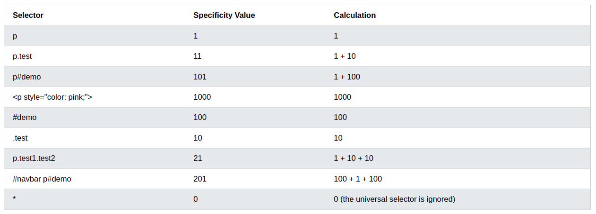

## Units

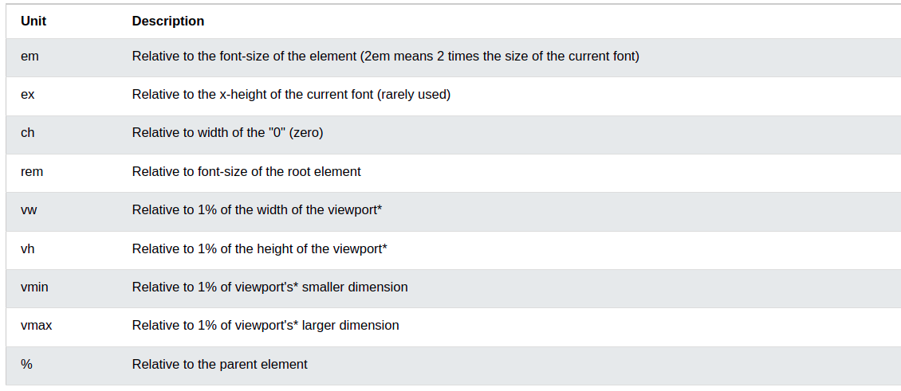

## Box model

The CSS box model is essentially a box that wraps around every HTML element. It consists of: margins, borders, padding, and the actual content. The image below illustrates the box model:

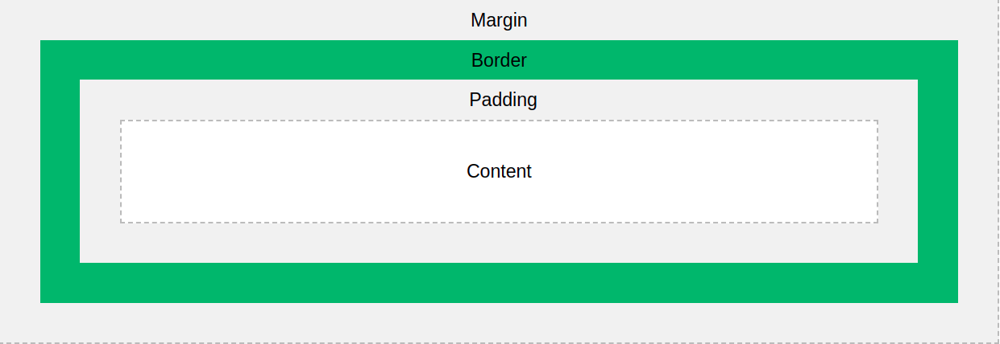

Explanation of the different parts:

-   **Content** - The content of the box, where text and images appear
-   **Padding** - Clears an area around the content. The padding is transparent
-   **Border** - A border that goes around the padding and content
-   **Margin** - Clears an area outside the border. The margin is transparent

The box model allows us to add a border around elements, and to define space between elements.

ex.

```css
div {
	background-color: lightgrey;
	width: 300px;
	border: 15px solid green;
	padding: 50px;
	margin: 20px;
}
```

-   When we set the width and height of an element it sets the width and height of the content and not the entire box.
-   To remove this add to the body element and this will set the height and widht of the entire box now.

```css
* {
	box-sizing: border-box;
}
```

-   Originally it is `content-box`

## Positions

The `position` property specifies the type of positioning method used for an element.

There are five different position values:

-   `static`
-   `relative`
-   `fixed`
-   `absolute`
-   `sticky`

Elements are then positioned using the top, bottom, left, and right properties. However, these properties will not work unless the `position` property is set first. They also work differently depending on the position value.

### position: static;

-   HTML elements are positioned static by default.

-   Static positioned elements are not affected by the top, bottom, left, and right properties.

-   An element with `position: static;` is not positioned in any special way; it is always positioned according to the normal flow of the page:

**Example**

```css
div.static {
	position: static;
	border: 3px solid #73ad21;
}
```

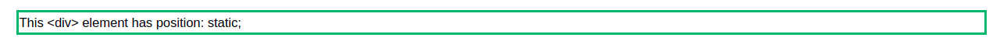

### position: relative;

An element with `position: relative;` is positioned relative to its normal position.

Setting the top, right, bottom, and left properties of a relatively-positioned element will cause it to be adjusted away from its normal position. Other content will not be adjusted to fit into any gap left by the element.

If top is set to 20px then it would be off from top at 20px. And if `top:-20px` then it would be up by 20px.

**Example**

```css
div.relative {
	position: relative;
	left: 30px;
	border: 3px solid #73ad21;
}
```

### position: fixed;

An element with `position: fixed;` is positioned relative to the viewport, which means it always stays in the same place even if the page is scrolled. The top, right, bottom, and left properties are used to position the element.

A fixed element does not leave a gap in the page where it would normally have been located.

**Example to position something at the bottom right of the screen**

```css
div.fixed {
	position: fixed;
	bottom: 0;
	right: 0;
	width: 300px;
	border: 3px solid #73ad21;
}
```


### position: absolute;

An element with `position: absolute;` is positioned relative to the nearest positioned ancestor (instead of positioned relative to the viewport, like fixed).

However; if an absolute positioned element has no positioned ancestors, it uses the document body, and moves along with page scrolling.

**Note:** Absolute positioned elements are removed from the normal flow, and can overlap elements.

```css
div.relative {
	position: relative;
	width: 400px;
	height: 200px;
	border: 3px solid #73ad21;
}

div.absolute {
	position: absolute;
	top: 80px;
	right: 0;
	width: 200px;
	height: 100px;
	border: 3px solid #73ad21;
}
```

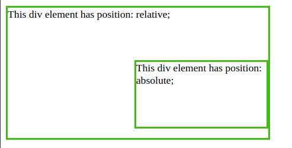

### position: sticky;

An element with `position: sticky;` is positioned based on the user's scroll position.

A sticky element toggles between `relative` and `fixed`, depending on the scroll position. It is positioned relative until a given offset position is met in the viewport - then it "sticks" in place (like position:fixed).


## max-width etc.

Setting width of an element in say px will make sure that the width will be that only even if the browser window size changes and to accomodate for that it will add a horizontal scrollbar.

Setting `max-width` will ensure that it will have that specified width till it can fit in the browser window but on smaller screen it will accomodate itself.


```css
<!DOCTYPE html>
<html>
<head>
<style>
div.ex1 {
  width: 500px;
  margin: auto;
  border: 3px solid #73AD21;
}

div.ex2 {
  max-width: 500px;
  margin: auto;
  border: 3px solid #73AD21;
}
</style>
</head>
<body>

<h2>CSS Max-width</h2>

<div class="ex1">This div element has width: 500px;</div>
<br>

<div class="ex2">This div element has max-width: 500px;</div>

</body>
</html>
```

Same for `max-height`

### min-width

The element's width is set to the value of `min-width` whenever `min-width` is larger than `max-width` or `width`.

## Media Queries

We use media queries to define different styles based on the screen size of the device.

ex.

```css
body {
	color: red;
	font-size: 40px;
}

/*
All means that use this media query for the screen, print and speech
Also can concatenate different queries using and
*/

/* any screen below width of 600px will have the color blue for the font */
@media all and (max-width: 600px) {
	body {
		color: blue;
	}
}

/* we can skip the all keyword since it defaults to all types by default */
```


-   CSS reads from top to bottom so it will always go with the bottom selector in case our media query is on the top and then we apply a style to our element.
-   In case we need to do a **OR** statement just put a comma (,) in between.
-   Can also add `(orientation : landscape/portrait)` in the query

## Flexbox

Flexbox provides with an easier way to design layouts in the 1D.

Say we have this

```html
<div class="flex-container">
	<div class="flex-item">1</div>
	<div class="flex-item">2</div>
	<div class="flex-item">3</div>
</div>
```

```css
.flex-container {
	background-color: blue;
}

.flex-item {
	background-color: wheat;
	height: 20px;
	width: 20px;
	margin: 10px;
	padding: 10px;
	border: 1px solid black;
}
```

This will create

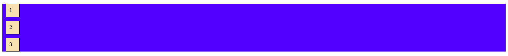

Using `display : flex` all of them will go in one line (default behaviour)

```css
.flex-container {
	background-color: blue;
	display: flex;
}
```

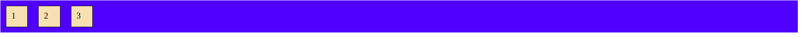

### flex-direction

flex-direction specifies the order in which direction the container should stack the items.

```css
.flex-container {
	flex-direction: row | row-reverse | column | column-reverse;
}
```

-   row is default behaviour

-   row-reverse

    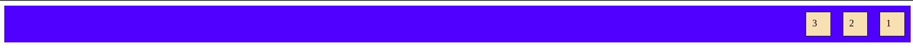

-   column

    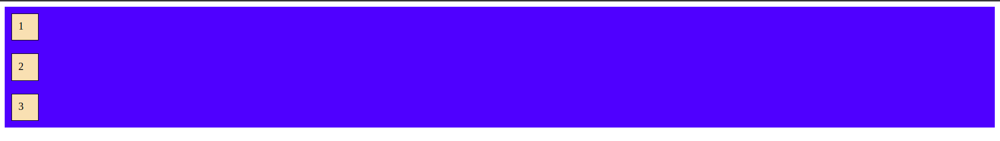

-   column-reverse

    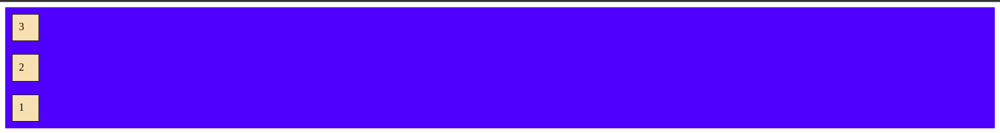

### flex-wrap

flex-wrap specifies whether on smaller screen the flex-items should wrap or not.

```css
.flex-container {
	display: flex;
	flex-wrap: wrap;
}
```


-   nowrap is the default value in that case the flex-items would just get smaller.

### justify-content

The `justify-content` property is used to align the flex items

```css
.flex-container {
	display: flex;
	justify-content: center;
}
```


```css
.flex-container {
	display: flex;
	justify-content: flex-start; /* this is default */
}
```

```css
.flex-container {
	display: flex;
	justify-content: flex-end;
}
```

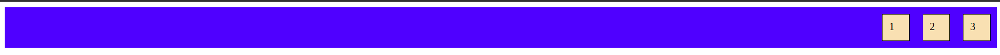

```css
.flex-container {
	display: flex;
	justify-content: space-around;
}
```

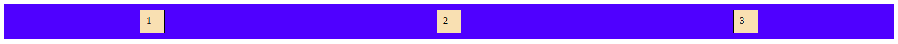

```css
.flex-container {
	display: flex;
	justify-content: space-between;
}
```

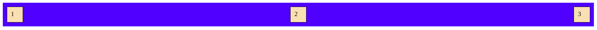

### align-items

Same as justify-content but does it in vertical direction.

```css
.flex-container {
	display: flex;
	align-items: center;
}
```

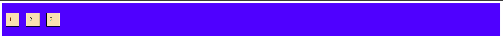

```css
.flex-container {
	display: flex;
	align-items: flex-start; /* this is default */
}
```

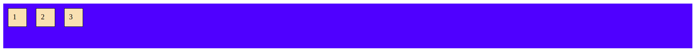

```css
.flex-container {
	display: flex;
	align-items: flex-end;
}
```

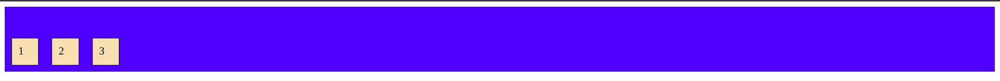

### Center a div

```css
.flex-container {
	display: flex;
	justify-content: center;
	align-items: center;
	height: 100vh;
	background-color: blue;
}

.flex-item {
	background-color: #f1f1f1;
	color: white;
	width: 100px;
	height: 100px;
}
```

**[Refer This as well](https://css-tricks.com/snippets/css/a-guide-to-flexbox/)**

## Transitions

CSS transitions can be used to do simple animations.

Add transition only to that element that uses it and not to the one where it happens

```css
.parent {
	background-color: blue;
	height: 400px;
	width: 400px;
}

.child {
	background-color: red;
	height: 50%;
	width: 50%;
	/* specify the property we want to transition */
	transition: width 1s;
}

.child:hover {
	width: 70%;
}
```


- Can also specify multiple properties at the same time

    ```css
    .child {
    	background-color: red;
    	height: 50%;
    	width: 50%;
    	/* specify the property we want to transition */
    	transition: width 1s, height 1s;
    }
    
    .child:hover {
    	width: 70%;
        height: 70%;
    }
    ```

- We can only do these basic steps using css transitions and if say wanted to add steps that would require to use animations properly.

## Animations

- Animation is added to where it happens

```css
.child:hover {
	/* forwards means that after my animation 100% keyframe is done keep the property */
    /* the name can be anything */
	animation: left-to-right 1s ease-in forwards;
	/* backward means at 0% keyframe */
	/* specifying both means will apply both */
}

@keyframes left-to-right {
	/* at 100 % do this */
    100% {
		transform: translateX(100%);
	}
}
```

```css
/* this makes the box go first down then r */
@keyframes left-to-right {
	0% {
		transform: translate(0);
	}

	33% {
		transform: translateY(100%);
	}

	66% {
		transform: translateX(100%) translateY(100%);
	}

	100% {
		transform: translateX(100%);
	}
}
```

