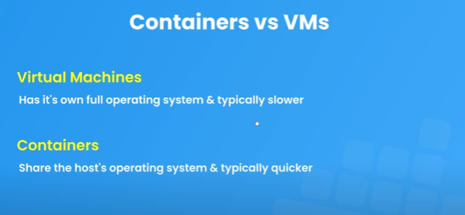
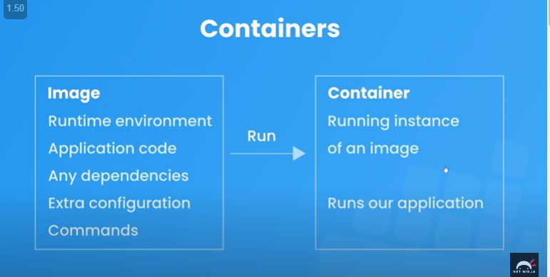
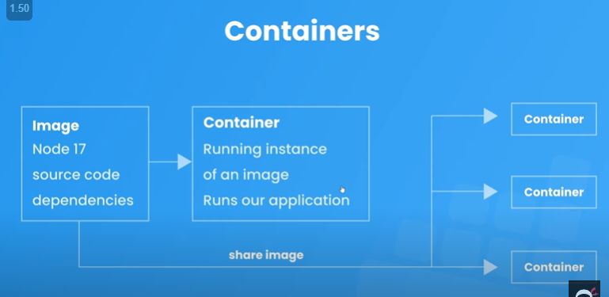
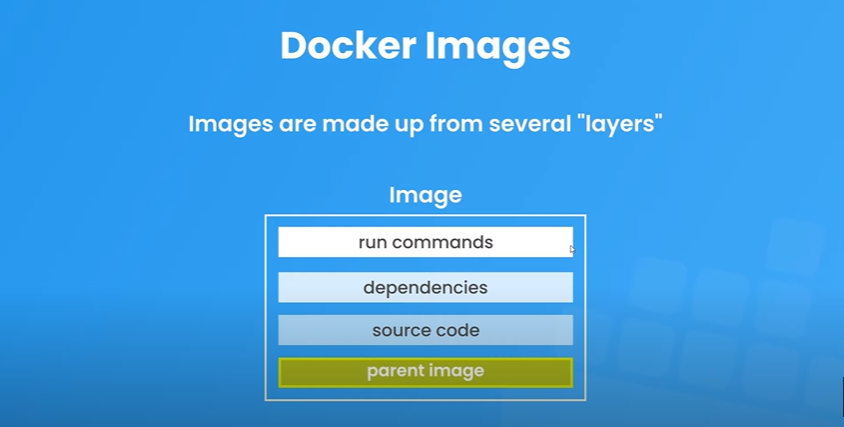

- [Docker](#docker)
  - [Docker Images](#docker-images)
  - [Layer Caching](#layer-caching)
  - [Volumes](#volumes)
  - [Docker Compose](#docker-compose)

# Docker
- **Container** -> A box or package that contains everything an application needs to run. Ex. the node version it was originally created on the source code, all the dependencies etc.
- **Docker** -> Tool that manages these containers.
- **Image** -> Blueprint for the container





## Docker Images


```Dockerfile
# From this specific version of node 
FROM node:17-alpine
# Set the working directory to /app
WORKDIR /app
# Copy all the files from source to destination in the image
COPY . .
# run the command npm install to build packages
RUN npm install
# Expose the port
EXPOSE 4000
# When the image is up run this command
CMD ["node", "app.js"]
```

- `docker build -t myapp .`
  - Create docker image with the name myapp where the dockerfile is located in the . directory ( relative path ).

- Either use docker desktop or 
  - `docker images` -> list all available images
  - `docker run --name myapp_c1 -p 4000:4000 myapp`
    - myapp_c1 -> name of container
    - myapp -> name of image
    - `-p 4000:4000` -> map the host port name to the docker one which we described in `EXPOSE`.
  - `docker ps` -> list running containers
  - `docker ps -a` -> list all containers
  - `docker stop container_name/container_id` -> stop the container
  - `docker start container_name` -> start the container that has already been made

## Layer Caching
- Docker by default caches a layer if no change has been made to it. Ex. if changed the app.js file the node image is going to remain the same so it will be taken from cache.
- But say if the package.json file wasnt changed but the code gets changes still the npm install command will be run again and not taken from cache. We can change this behaviour by installing npm modules first.

```Dockerfile
FROM node:17-alpine
WORKDIR /app
COPY package.json .
RUN npm install
COPY . .
EXPOSE 4000
CMD ["node", "app.js"]
```

## Volumes
- If we are making constant changes to the code and using `docker start` command then the code changes are not reflected in the image.
- Good for development to map local files to the image using volume.
- A Docker volume is an independent file system entirely managed by Docker and exists as a normal file or directory on the host, where data is persisted
- **The image does not change**
- Use -v in the docker run command with the absolute path of the folder
- [Refer this](https://earthly.dev/blog/docker-volumes/#:~:text=A%20Docker%20volume%20is%20an,keeping%20them%20secure%20and%20effective.)

## Docker Compose
- [Refer this](https://www.baeldung.com/ops/docker-compose)