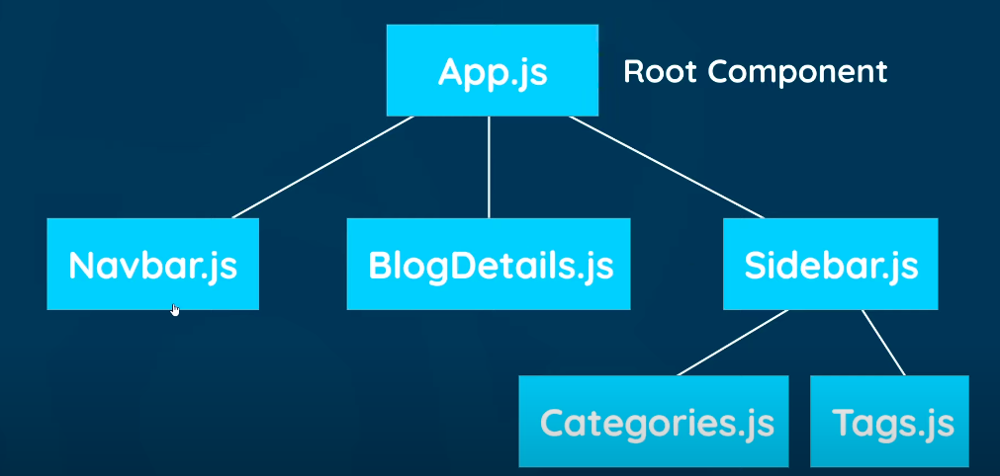
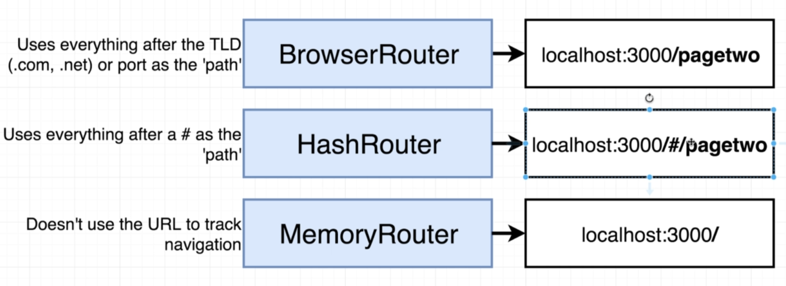
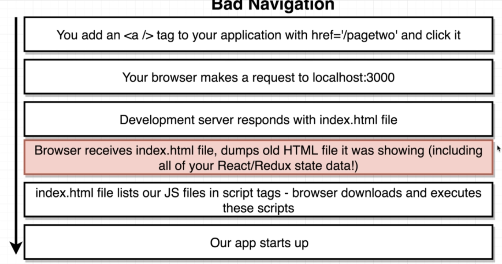
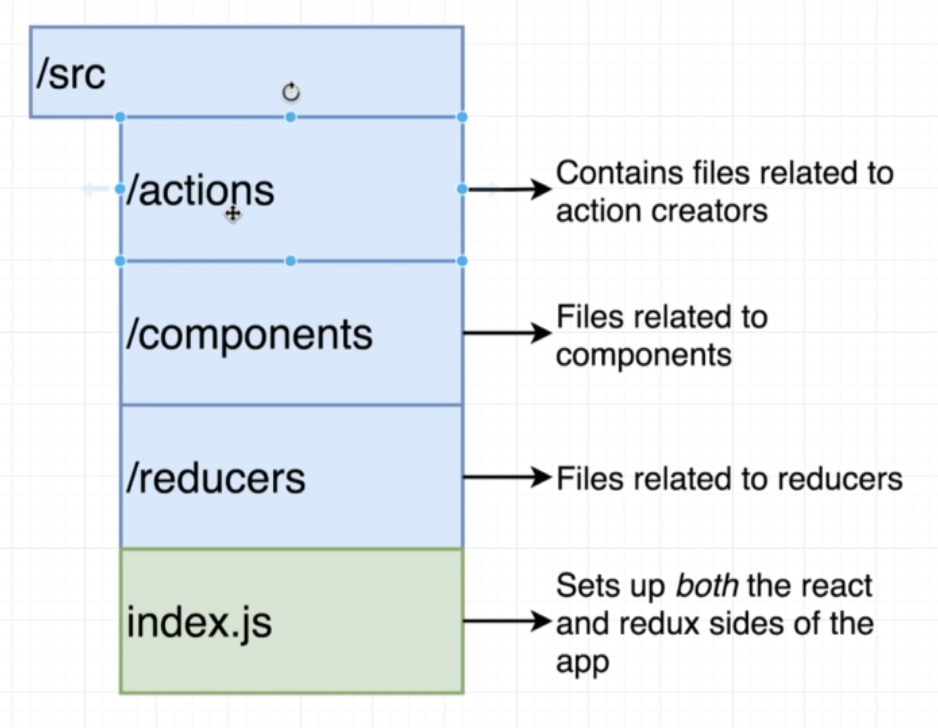

- [Introduction](#introduction)
- [Creating a React app](#creating-a-react-app)
- [Components](#components)
  - [Dynamic values](#dynamic-values)
  - [Multiple Components](#multiple-components)
  - [Styling Components](#styling-components)
    - [Inline styling](#inline-styling)
  - [Click Events](#click-events)
  - [State](#state)
  - [Outputting lists](#outputting-lists)
  - [Passing data to components using Props](#passing-data-to-components-using-props)
    - [Passing functions as props](#passing-functions-as-props)
- [useEffect Hook](#useeffect-hook)
  - [Dependency Array of useEffect Hook](#dependency-array-of-useeffect-hook)
  - [Fetching data](#fetching-data)
  - [Conditional Template](#conditional-template)
  - [Fetching errors](#fetching-errors)
- [Making custom hooks](#making-custom-hooks)
- [React Router](#react-router)
  - [Route Links](#route-links)
  - [useEffect Cleanup](#useeffect-cleanup)
  - [Route Parameters](#route-parameters)
- [Forms in React & Controlled Inputs](#forms-in-react--controlled-inputs)
  - [Controlled Inputs](#controlled-inputs)
  - [Submiting forms](#submiting-forms)
  - [Programming Redirect](#programming-redirect)
- [404 Pages](#404-pages)
- [Hooks Detailed](#hooks-detailed)
  - [useState](#usestate)
  - [useEffect](#useeffect)
  - [useMemo](#usememo)
  - [useRef](#useref)
  - [Context API & useContext](#context-api--usecontext)
- [Redux](#redux)
  - [Setting action, reducers only using redux](#setting-action-reducers-only-using-redux)
  - [Using react-redux](#using-react-redux)

**These notes don't cover class based components and only use hooks & functional components**

# Introduction

- JS Library to create **Single Page Apps**(SPA)
  - SPA - only needs to send one initial request to the server.

# Creating a React app

```
npx create-react-app myapp
```

# Components

- Component contain :

  - Template for displaying
  - Logic

- Component written using `jsx`
- A normal template function name should be capital also need to export it to the index.js file.

```jsx
// app.js file
import "./App.css";

function App() {
  return (
    // this is all jsx and not html
    // can't use class here since it is reserved js keyword
    // babel on the backend side of the code converts all of this into visible html
    <div className="App">
      <div className="content">
        <h1>App Component</h1>
      </div>
    </div>
  );
}

export default App;
```

```jsx
// index.js
import React from "react";
import ReactDOM from "react-dom";
import "./index.css";
import App from "./App";

// render app component on the screen using React which gets added to the root div inside the html
ReactDOM.render(
  <React.StrictMode>
    <App />
  </React.StrictMode>,
  document.getElementById("root")
);
```

## Dynamic values

- Can output any value inside curly braces `{}` except for objects and boolean values.

```jsx
function App() {
  const title = "Welcome to the new blog";
  const link = "http://www.google.com";
  return (
    <div className="App">
      <div className="content">
        <h1>{title}</h1>
        <p>{[1, 2, 3, 4]}</p> {/*will convert this to a string*/}
        <a href={link}>Google</a>
      </div>
    </div>
  );
}
```

## Multiple Components



- Type `sfc` for the snippet to work for a stateless functional component
- Make sure to export component at the end.

```jsx
// NavBar.js
// this is a stateless functional component
const Navbar = () => {
  return (
    <nav className="navbar">
      <h1>The Dojo Blog</h1>
      <div className="links">
        <a href="/">Home</a>
        <a href="/create">New Blog</a>
      </div>
    </nav>
  );
};

export default Navbar;
```

- Can now add the Navbar component in the main App component

```jsx
import Navbar from "./Navbar";
import Home from "./Home";
// App.js
function App() {
  return (
    <div className="App">
      {/* use it this way */}
      <Navbar />
      <div className="content">
        <Home />
      </div>
    </div>
  );
}
```

## Styling Components

- When we import a css file to say the App component it will add that css to all the components nested inside the App component as well it does not get scoped.
- Any css file imported to the index.js file will apply to the entire project.
  - Can use styled components or css modules for scoping styles.
- For smaller apps it's better to add all the styles to the index.css file and import that to the index.js file

### Inline styling

- To do inline styling need to use double curly braces one to tell it is javascript and other for object itself

```jsx
<a href="/create" style={{
    color: "white",
    backgroundColor: "#f1356d",
    borderRadius: "8px",
  }}
>
```

## Click Events

- When assigning reference don't invoke the function since then it will just run

```jsx
const Home = () => {
  const handleClick = () => {
    console.log("hello there");
  };

  return (
    <div className="home">
      <h2>Home</h2>
      <button onClick={handleClick}>Click me</button>
    </div>
  );
};
```

- If want to pass value need to declare an anonymous function first which then calls the main function since anonymous function gets called when the event happens which in turn calls the main event function

```jsx
const Home = () => {
  const handleClick = (name) => {
    console.log(name));
  };

  return (
    <div className="home">
      <h2>Home</h2>
      <button onClick={() => handleClick('some name')}>Click me</button>
    </div>
  );
};
```

- The event object gets passed to the function automatically

```jsx
const Home = () => {
  const handleClick = (event) => {
    console.log(event);
  };

  return (
    <div className="home">
      <h2>Home</h2>
      <button onClick={handleClick}>Click me</button>
    </div>
  );
};
```

## State

- Some data that gets updated and we want react to re-render based on that change.
- Can use the `useState` hook which tells react to watch over the data so that the UI update when the data changes
- Use `setState` to set the value

```jsx
const Home = () => {
  // useState returns two things which we are getting by array destructuring
  // first should be the name of the variable and second is the setState function
  const [name, setName] = useState("chirag");
  const [age, setAge] = useState(25);

  const handleClick = () => {
    setName("changed name");
    setAge(20);
  };

  return (
    <div className="home">
      <h2>Home</h2>
      <p>
        {name} is {age} years old
      </p>
      <button onClick={handleClick}>Click me</button>
    </div>
  );
};
```

## Outputting lists

- Each value in the list needs to have a unique key property of its own so that react can differentiate b/w them

```jsx
import { useState } from "react";

const Home = () => {
  const [blogs, setBlogs] = useState([
    // the id's must be unique
    // when we store data on some server usually they have their own id
    {
      title: "My new website",
      body: "lorem ipsum ...",
      author: "person1",
      id: 1,
    },
    {
      title: "Title 2",
      body: "lorem ipsum ...",
      author: "person2",
      id: 2,
    },
    {
      title: "Title 3",
      body: "lorem ipsum ...",
      author: "person3",
      id: 3,
    },
  ]);

  return (
    <div className="home">
      {blogs.map((blog) => (
        // the key must be unique
        <div className="blog-preview" key={blog.id}>
          <h2>{blog.title}</h2>
          <p>Written by {blog.author}</p>
        </div>
      ))}
    </div>
  );
};

export default Home;
```

## Passing data to components using Props

- Can pass data to child components using props property

```jsx
// Child of some component
// BlogList.js

// can destructure it in the call itself
const BlogList = ({ blogs }) => {
  // const blogs = props.blogs;

  return (
    <div className="blog-list">
      {blogs.map((blog) => (
        // the key must be unique
        <div className="blog-preview" key={blog.id}>
          <h2>{blog.title}</h2>
          <p>Written by {blog.author}</p>
        </div>
      ))}
    </div>
  );
};

export default BlogList;
```

- Passed it using

```jsx
// parent component
return (
  <div className="home">
    {/*blogs will be available as a prop to the BlogList component*/}
    <BlogList blogs={blogs} />
  </div>
);
```

- Can use multiple components as well and pass them diff props

```jsx
return (
  <div className="home">
    <BlogList blogs={blogs} title="All Blogs" />
    <BlogList
      blogs={blogs.filter((blog) => blog.author === "person1")}
      title={"Person 1 Blogs"}
    />
  </div>
);
```

### Passing functions as props

- We can't access the original state in a child component through the props and the state will only be available in the parent component.
- Ex. say to delete something from the state we can declare the function in the parent component and pass that function reference as a prop to the child component which can call it using that reference

```jsx
// parent
const handleDelete = (id) => {
  const newBlogs = blogs.filter((blog) => blog.id !== id);
  setBlogs(newBlogs);
};

return (
  <div className="home">
    <BlogList blogs={blogs} title="All Blogs" handleDelete={handleDelete} />
  </div>
);
```

```jsx
// child
const BlogList = ({ blogs, title, handleDelete }) => {
  return (
    <div className="blog-list">
      <h2>{title}</h2>
      {blogs.map((blog) => (
        // the key must be unique
        <div className="blog-preview" key={blog.id}>
          <h2>{blog.title}</h2>
          <p>Written by {blog.author}</p>
          // IDHAR DEKH
          <button onClick={() => handleDelete(blog.id)}>Delete Blog</button>
        </div>
      ))}
    </div>
  );
};
```

# useEffect Hook

- Runs everytime when there is a re-render
- Useful when we have to fetch data or auth service (side effects in react)
- Don't change state in useEffect since it can lead to infinite loop of changing state -> re-render -> useEffect runs -> change state...

## Dependency Array of useEffect Hook

- If we want that useEffect should only run if a certain state changes we can pass it to the _dependency array_

```jsx
useEffect(() => {
  console.log("use effect run");
}, [name]);
```

- Will only run if there is a change in state of name.
- Passing an empty array will make sure that it runs only once at the starting so can change state in that case

```jsx
useEffect(() => {
  console.log("use effect run only at the start");
}, []);
```

## Fetching data

- Can't make the useEffect callback function async need to use a `.then` to resolve promises inside it
- If want to use `async-await` syntax declare a seperate function and call it from the useEffect hook

```jsx
useEffect(() => {
  axios
    .get("http://localhost:8000/blogs")
    .then((res) => {
      setBlogs(res.data);
    })
    .catch((err) => {
      console.log(err);
    });
  // will only run once because of this dependency array
  // fetch data only once
}, []);
```

## Conditional Template

- _If state is initially null and our request from useEffect hook will take some time then we need to use conditional render using `&&` operator_ ex.

```jsx
const [blogs, setBlogs] = useState(null);
useEffect(() => {
  // gets some data
  setBlogs(newData);
});
return (
  <div className="home">
    // if blogs initially null will not render it since false
    {blogs && (
      <BlogList blogs={blogs} title="All Blogs" handleDelete={handleDelete} />
    )}
  </div>
);
```

## Fetching errors

- If we get errors while making a request we can throw it and then catch it inside of then-catch statements and output that error by storing it inside state.

```jsx
// this is what the file looks till now
//
import { useState, useEffect } from "react";
import BlogList from "./BlogList";

const Home = () => {
  const [blogs, setBlogs] = useState(null);
  const [isPending, setIsPending] = useState(true);
  const [error, setError] = useState(null);

  useEffect(() => {
    fetch("http://localhost:8000/blogss")
      .then((res) => {
        if (!res.ok) {
          throw Error("Could not fetch the data");
        }
        return res.json();
      })
      .then((data) => {
        setBlogs(data);
        setIsPending(false);
        setError(null);
      })
      .catch((err) => {
        setIsPending(false);
        setError(err.message);
      });
  }, []);

  return (
    <div className="home">
      {error && <div>{error}</div>}
      {isPending && <div>Loading...</div>}
      {blogs && <BlogList blogs={blogs} title="All Blogs" />}
    </div>
  );
};

export default Home;
```

# Making custom hooks

- We can have a lot of code that gets resused over which essentialy does the same thing differently ex. fetching some data and then setting state errors
- Custom hooks need to start with the `use` keyword otherwise won't work
- ex. converting above fetch function to a hook which takes in a url and has a dependency on it

```jsx
//useFetch.js
import { useState, useEffect } from "react";

// this hooks does is to declare initial state and whenever the url updates it sets the state to the new one
const useFetch = (url) => {
  const [data, setData] = useState(null);
  const [isPending, setIsPending] = useState(true);
  const [error, setError] = useState(null);

  useEffect(() => {
    // only using setTimeout to simulate a real request
    setTimeout(() => {
      fetch(url)
        .then((res) => {
          if (!res.ok) {
            throw Error("Could not fetch the data for that resource");
          }
          return res.json();
        })
        .then((data) => {
          setData(data);
          setIsPending(false);
          setError(null);
        })
        .catch((err) => {
          setIsPending(false);
          setError(err.message);
        });
    }, 500);
  }, [url]); // will need to pass url as a dependency since whenever it changes it should re-run

  // when using hooks generally return an array but by using object we don't have to worry about the order in which we get stuff back
  return { data, isPending, error };
};

export default useFetch;
```

```jsx
// Home.js
const Home = () => {
  const {
    // grab the data but call it blogs instead
    data: blogs,
    isPending,
    error,
  } = useFetch("http://localhost:8000/blogs");

  return (
    <div className="home">
      {error && <div>{error}</div>}
      {isPending && <div>Loading...</div>}
      {blogs && <BlogList blogs={blogs} title="All Blogs" />}
    </div>
  );
};
```

# React Router

- Normal webpages when going to a new page send request to a server and get the code back
- In React SPA initially all the js bundle is sent and when a new request is made to a page ReactDOM updates the dom accordingly
- Install using

```
npm install react-router-dom
```

- Enclose the main App component inside a Router and then define the Routes
  - Inside Routes define different Route which have different path which display different componentes



```jsx
// App.js
import Navbar from "./Navbar";
import Home from "./Home";
// This is different from v5 react-router-dom
import { BrowserRouter as Router, Route, Routes } from "react-router-dom";

function App() {
  return (
    <Router>
      <div className="App">
        {/* The NavBar will always show since it is not inside the Routes */}
        <Navbar />
        <div className="content">
          <Routes>
            <Route path="/" element={<Home />} />
            <Route path="/create" element={<Create />} />
          </Routes>
        </div>
      </div>
    </Router>
  );
}

export default App;
```

- For mulitple routes in older versions needed to pass in `exact` keyword if we want react to look at the exact url and not go to the first url it finds

  - ex. if 1st route -> `/` & 2nd route -> `/create` react will just go straight to the 1st route since it used to do a partial match only.

- New versions do the exact path straight away without mentioning it
- If want to go to a child url can use `path='/users/*` if want the old behaviour

## Route Links

- Using anchor tags `<a>` is a bad idea
  
- Can use `Link` component instead from the react-router packages
- Uses to as a attribute
- In the html they are still an anchor tag but a new request is not sent to the server

```jsx
import { Link } from "react-router-dom";
// this is a stateless functional component
const Navbar = () => {
  return (
    <nav className="navbar">
      <h1>The Dojo Blog</h1>
      <div className="links">
        <Link to="/">Home</Link>
        <Link to="/create">New Blog</Link>
      </div>
    </nav>
  );
};

export default Navbar;
```

## useEffect Cleanup

- When a fetch request using our useFetch request has been made and the state hasn't been updated till yet/request has not been completed and we change the page while the request was still in process and the main component gets unmounted so can't make the state changes

  - need to stop that request from being made

- Can use a `AbortController`

```jsx
// useFetch hook
import { useState, useEffect } from "react";

// this hooks does is to declare initial state and whenever the url updates it sets the state to the new one
const useFetch = (url) => {
  const [data, setData] = useState(null);
  const [isPending, setIsPending] = useState(true);
  const [error, setError] = useState(null);

  useEffect(() => {
    // DEFINE A ABORTCONTROLLER HERE
    const abortController = new AbortController();

    setTimeout(() => {
      // PASS IT ALONG THE FETCH AS SIGNAL PROPERTY
      fetch(url, { signal: abortController.signal })
        .then((res) => {
          if (!res.ok) {
            throw Error("Could not fetch the data for that resource");
          }
          return res.json();
        })
        .then((data) => {
          setData(data);
          setIsPending(false);
          setError(null);
        })
        .catch((err) => {
          // if we set the error state then the same problem will be there
          // just check for AbortError and other errors seperately
          if (err.name === "AbortError") {
            console.log("fetch Aborted");
          } else {
            setIsPending(false);
            setError(err.message);
          }
        });
    }, 500);

    // THIS IS WHERE THE USEEFFECT CLEANUP FUNCTION IS
    // RETURN THIS ON CLEANUP / WHEN THE COMPONENT GETS UNMOUNTED
    return () => abortController.abort();
  }, [url]);

  return { data, isPending, error };
};

export default useFetch;
```

## Route Parameters

- To get access to route parameters like id in `blogs/:id` can use the `useParams` hook

```jsx
import { useParams } from "react-router-dom";

const BlogDetails = () => {
  // just destructure whatever it is named in the Route parameter definition
  const { id } = useParams();

  return (
    <div className="blog-details">
      <h2>Blog details - {id}</h2>
    </div>
  );
};

export default BlogDetails;
```

# Forms in React & Controlled Inputs

## Controlled Inputs

- When adding something to a input field we want to udpate the state as well with every change we can use controlled inputs in that case.

```jsx
// Create.js
// Contains a form with input elements
import { useState } from "react";

const Create = () => {
  // initial states for text inputs should be an empty string
  const [title, setTitle] = useState("");
  const [body, setBody] = useState("");
  const [author, setAuthor] = useState("person1");

  return (
    <div className="create">
      <h2>Add a New Blog</h2>
      {/* this form right now does not do anything */}
      <form>
        <label>Blog title:</label>
        {/*on any change we will set the value inside the state to be equal to that 
        e is the event object 
        target will be the tag
        and its value will be the text value
        */}
        {/*value of this input element will always be equal to the value inside the state*/}
        <input
          type="text"
          required
          value={title}
          onChange={(e) => setTitle(e.target.value)}
        />
        <label>Blog body</label>
        {/*react textarea can change the value */}
        <textarea
          required
          value={body}
          onChange={(e) => setBody(e.target.value)}
        ></textarea>
        <label>Blog author</label>
        <select value={author} onChange={(e) => setAuthor(e.target.value)}>
          <option value="person1">Person 1</option>
          <option value="person2">Person 2</option>
        </select>
        <button>Add Blog</button>
        <p>{title}</p>
        <p>{body}</p>
        <p>{author}</p>
      </form>
    </div>
  );
};

export default Create;
```

## Submiting forms

- Normally like vanilla javascript just add a onSubmit handler to the form and prevent default action of a post request

```jsx
import { useState } from "react";
import axios from "axios";

const Create = () => {
  const [title, setTitle] = useState("");
  const [body, setBody] = useState("");
  const [author, setAuthor] = useState("person1");

  const handleSubmit = async (e) => {
    e.preventDefault();
    const blog = { title, body, author };
    await axios.post("http://localhost:8000/blogs", blog);
    // USING FETCH API
    // fetch("http://localhost:8000/blogs", {
    //   // json server will add the id property for us
    //   method: "POST",
    //   headers: { "Content-Type": "application/json" },
    //   body: JSON.stringify(blog),
    // }).then(() => console.log("new blog added"));
  };

  return (
    <div className="create">
      <h2>Add a New Blog</h2>
      <form onSubmit={handleSubmit}>
        <label>Blog title:</label>
        <input
          type="text"
          required
          value={title}
          onChange={(e) => setTitle(e.target.value)}
        />
        <label>Blog body</label>
        <textarea
          required
          value={body}
          onChange={(e) => setBody(e.target.value)}
        ></textarea>
        <label>Blog author</label>
        <select value={author} onChange={(e) => setAuthor(e.target.value)}>
          <option value="person1">Person 1</option>
          <option value="person2">Person 2</option>
        </select>
        <button>Add Blog</button>
      </form>
    </div>
  );
};

export default Create;
```

## Programming Redirect

- Use the `useNavigate` hook to navigate to another page after doing some task like submitting a form
- Was called `useHistory` in earlier versions
  - difference in both
- Pass in the path to navigate function
  - Passing in -1 will go back 1 page

```jsx
import { useState } from "react";
import {useNavigate} from 'react-router-dom';
import axios from "axios";

const Create = () => {
  const [title, setTitle] = useState("");
  const [body, setBody] = useState("");
  const [author, setAuthor] = useState("person1");
  const navigate = useNavigate();

  const handleSubmit = async (e) => {
    e.preventDefault();
    const blog = { title, body, author };

    await axios.post("http://localhost:8000/blogs", blog);

    // after submitting navigate to the home page
    navigate('/');

  };

  return(
    // something
  )
}
```

# 404 Pages

- This is like a catch all page if user goes to any url that is not defined in the routes
- Add a new Route inside Router with a path to \* and place it at the end

```jsx
// App.js
import Navbar from "./Navbar";
import Home from "./Home";
import { BrowserRouter as Router, Route, Routes } from "react-router-dom";
import Create from "./Create";
import BlogDetails from "./BlogDetails";
import NotFound from "./NotFound";

function App() {
  return (
    <Router>
      <div className="App">
        {/* The NavBar will always show since it is not inside the Routes */}
        <Navbar />
        <div className="content">
          <Routes>
            <Route path="/" element={<Home />} />
            <Route path="/create" element={<Create />} />
            <Route path="/blogs/:id" element={<BlogDetails />} />
            <Route path="*" element={<NotFound />} />
          </Routes>
        </div>
      </div>
    </Router>
  );
}

export default App;
```

# Hooks Detailed

## useState

- If want to change the state based on previous state can pass in function inside the setState function as well

```jsx
function App() {
  const [count, setCount] = useState(3);

  // rather than just setting the state will update it now using the previous one
  function decrementCount() {
    setCount((prevCount) => prevCount - 1);
  }

  function incrementCount() {
    setCount((prevCount) => prevCount + 1);
  }
}
```

## useEffect

- Same as above
- Can also be used to add event Listeners to some elements on mounting of a component ex. the window

## useMemo

- There are a lot of functions that may take a lot of time but give out the same output for the same input on every re-render
- `useMemo()`is a built-in React hook that accepts 2 arguments — a function compute that computes a result and the depedencies array:

```jsx
const memoizedResult = useMemo(compute, dependencies);
```

- During initial rendering, useMemo(compute, dependencies) invokes compute, memoizes the calculation result, and returns it to the component.

- If during next renderings the dependencies don't change, then useMemo() doesn't invoke compute but returns the memoized value.

- But if dependencies change during re-rendering, then useMemo() invokes compute, memoizes the new value, and returns it.

```jsx
// inside a component
const doubleNumber = useMemo(() => {
  return slowFunction(number);
  // this also uses a dependency array like useEffect
  // will only run this again if number changes
}, [number]);
```

## useRef

- We can't do something like telling how many times a component has rendered using `useState` and `useEffect` since that would lead to infinite loop
- ex. **THIS WILL LEAD TO INFINITE LOOP**

```jsx
import { useState, useEffect } from "react";

function App() {
  const [name, setName] = useState("");
  const [renderCount, setRenderCount] = useState(0);

  useEffect(() => {
    setRenderCount((prevRenderCount) => prevRenderCount + 1);
  });

  return (
    <div>
      <input value={name} onChange={(e) => setName(e.target.value)} />
      <div>My name is {name}</div>
      <div>I rendered {renderCount} times</div>
    </div>
  );
}

export default App;
```

- Better way would be to use `useRef` hook
- Only has the current property inside it

```jsx
const renderCount = useRef(0);
useEffect(() => {
  renderCount.current = renderCount.current + 1;
});
return (
  <div>
    <input value={name} onChange={(e) => setName(e.target.value)} />
    <div>My name is {name}</div>
    <div>I rendered {renderCount.current} times</div>
  </div>
);
```

- **Can also add references for elements and then do lets say add focus on a text input**

```jsx
const inputRef = useRef();

function focus(){
  // HTMLElement.focus()
  inputRef.current.focus();
}

<input ref={inputRef}/>
<button onClick={focus}>Focus on input field</button>
```

## Context API & useContext

- Context API in react provides a way to pass down data through the components without having to pass props through all the nested components.
  - ex. each component needs to know the current user selected theme but passing it everytime as prop will not be a good idea
- Setting event binding for ex. deleting something from the state 50 components deep is not a good idea using normal methods like passing down props.

- ex. Using context api to pass a list of movies to a Nav component to list size of movies and to a AddMovie component to add movies to the list.

- Creating a context ( refer comments for explanation )

```jsx
// MovieContext.js
import { useState, createContext } from "react";

// The way it is all going to work is whenever we need the movie list from the MovieProvider we just use the MovieContext

// creating a movie context same name as file name
export const MovieContext = createContext();

// this is the context provider
// provide the information
export const MovieProvider = (props) => {
  const [movies, setMovies] = useState([
    {
      name: "movie 1",
      price: "10",
      id: 232,
    },
    {
      name: "movie 2",
      price: "20",
      id: 233,
    },
    {
      name: "movie 3",
      price: "30",
      id: 234,
    },
    {
      name: "movie 4",
      price: "40",
      id: 235,
    },
  ]);
  return (
    // pass everything that we want to access as a array to the value property
    <MovieContext.Provider value={[movies, setMovies]}>
      {/* will pass it down to all the different components inside it*/}
      {props.children}
    </MovieContext.Provider>
  );
};
```

- Passing the data to other components inside the main App.js file

```jsx
// App.js
import "./App.css";
import { MovieProvider } from "./MovieContext";
import MovieList from "./MovieList";
import AddMovie from "./AddMovie";
import Nav from "./Nav";

function App() {
  return (
    // just wrap all the components that we want to pass the state down to inside the MovieProvider
    <MovieProvider>
      <div className="App">
        <Nav />
        <AddMovie />
        <MovieList />
      </div>
    </MovieProvider>
  );
}

export default App;
```

- Using the data from the Context

```jsx
import { useContext } from "react";
// import the context
import { MovieContext } from "./MovieContext";

const Nav = () => {
  // using the context
  const [movies, setMovies] = useContext(MovieContext);
  return (
    <div>
      <h3>Chirag Jain</h3>
      {/*available to this component now*/}
      <p>Number of Movies : {movies.length}</p>
    </div>
  );
};

export default Nav;
```

- Updating the data of a context

```jsx
import { useState, useContext } from "react";
import { MovieContext } from "./MovieContext";

const AddMovie = () => {
  const [name, setName] = useState("");
  const [price, setPrice] = useState("");
  const [movies, setMovies] = useContext(MovieContext);

  const addMovie = (e) => {
    e.preventDefault();
    // take the prevMovies destructure them add the new movie to the array and set it as the new one
    setMovies((prevMovies) => [
      ...prevMovies,
      // id is required for react lists to work
      { name, price, id: Math.random() * 1000 },
    ]);
  };

  return (
    <form onSubmit={addMovie}>
      <input
        type="text"
        name="name"
        placeholder="Name"
        value={name}
        onChange={(e) => setName(e.target.value)}
      />
      <input
        type="text"
        name="price"
        placeholder="Price"
        value={price}
        onChange={(e) => setPrice(e.target.value)}
      />
      <button>Submit</button>
    </form>
  );
};

export default AddMovie;
```

- **The only problem is that whenever we change something in the state everthing that is using that provider is going to re-render.**

# Redux

- Redux is a state management library for react
- It holds all the state of the entire app in a **central data source / single source of truth** known as **store**
- Alternative to using the context API in large applications
- Individual components can then access the state on their own without having to pass down as props and having to bind functions like delete and such in a parent component

- **STORE ->** GLOBALISED STATE
- **ACTION ->** describes what you want to do ,doesnt mean you actually do that thing
- **REDUCER ->** taking in an action and data and then process the action and return it so it can be centrailised
- **DISPATCH ->** dispatch this action to the reducer and then the reducer checks what to do and then the store gets updated

## Setting action, reducers only using redux

```jsx
// this is the main index.js file
import React, { createElement } from "react";
import ReactDOM from "react-dom";
import App from "./App";
import "./index.css";
import { createStore } from "redux";

// ACTIONS
const increment = () => {
  return {
    // type is just like the name of the action
    type: "INCREMENT",
  };
};

const decrement = () => {
  return {
    type: "DECREMENT",
  };
};

// REDUCER
const counter = (state = 0, action) => {
  // based on the action type that we get it's going to return a piece of state
  switch (action.type) {
    case "INCREMENT":
      return state + 1;
    case "DECREMENT":
      return state - 1;
  }
};

// create a store/global state that holds our reducer
let store = createStore(counter);

// display it in the console
store.subscribe(() => console.log(store.getState()));

// DISPATCH
store.dispatch(increment());

ReactDOM.render(
  <React.StrictMode>
    <App />
  </React.StrictMode>,
  document.getElementById("root")
);
```

## Using react-redux



- Simple code to illustrate two state (counter,isLogged) present inside a redux store.
- Refer this code or inside the practice-codebook/react/redux folder on desktop
- index.js file setup for redux

```jsx
import React from "react";
import ReactDOM from "react-dom";
import App from "./App";
import "./index.css";
import { createStore } from "redux";
import allReducers from "./reducers/index";
import { Provider } from "react-redux";

const store = createStore(
  // second argument is for redux dev tools extension to work
  allReducers,
  window.__REDUX_DEVTOOLS_EXTENSION__ && window.__REDUX_DEVTOOLS_EXTENSION__()
);

ReactDOM.render(
  <React.StrictMode>
    {/* add the provider here and pass it the store */}
    <Provider store={store}>
      <App />
    </Provider>
  </React.StrictMode>,
  document.getElementById("root")
);
```

- Creating Reducers

```jsx
// inside the reducers folder
// this takes the state and depending on the action type that has been dispatched does its thing
const counterReducer = (state = 0, action) => {
  switch (action.type) {
    case "INCREMENT":
      return state + 1;
    case "DECREMENT":
      return state - 1;
    default:
      return state;
  }
};

// export it
export default counterReducer;
```

```jsx
const loggedReducer = (state = false, action) => {
  switch (action.type) {
    case "SIGN_IN":
      return !state;
    default:
      return state;
  }
};

export default loggedReducer;
```

- reducers/index.js file to combine all the reducers

```jsx
import counterReducer from "./counter";
import loggedReducer from "./isLogged";
import { combineReducers } from "redux";

const allReducers = combineReducers({
  counter: counterReducer,
  isLogged: loggedReducer,
});

export default allReducers;
```

- Creating actions
- Do seperate exports since need to use multiple things in diff files

```jsx
// actions/index.js
export const increment = () => {
  return {
    type: "INCREMENT",
  };
};

export const decrement = () => {
  return {
    type: "DECREMENT",
  };
};

export const signin = () => {
  return {
    type: "SIGN_IN",
  };
};
```

- Using them inside the main file or other files

```jsx
// App.js
import { useSelector, useDispatch } from "react-redux";
import { increment, decrement, signin } from "./actions/index";

function App() {
  // useSelector is just a hook that gives access to the entire redux store state
  const counter = useSelector((state) => state.counter);
  const isLogged = useSelector((state) => state.isLogged);
  // useDispatch is the hook to use for dispatching
  const dispatch = useDispatch();

  return (
    <div className="App">
      <h1>Counter : {counter}</h1>
      {/*on clicking the button dispatch this action which fed to the reducer and based on the type of action changes the central state */}
      <button onClick={() => dispatch(increment())}>+</button>
      <button onClick={() => dispatch(decrement())}>-</button>
      <button onClick={() => dispatch(signin())}>Sign In</button>
      {isLogged && (
        <p>
          Some information that should only be seen if the user if logged in
        </p>
      )}	
    </div>
  );
}

export default App;
```

- If want to pass a value to the action when dispatching like `dispatch(increment(5))` while defining what the action does pass in the data as a payload property and then in the reducer access it using `action.payload`

```jsx
// actions
export const increment = (number) => {
  return {
    type: "INCREMENT",
    // pass it like this
    // generally called payload
    payload: number,
  };
};
```

```jsx
// reducer
const counterReducer = (state = 0, action) => {
  switch (action.type) {
    case "INCREMENT":
      // can access the payload here
      return state + action.payload;
    case "DECREMENT":
      return state - 1;
    default:
      return state;
  }
};

export default counterReducer;
```
