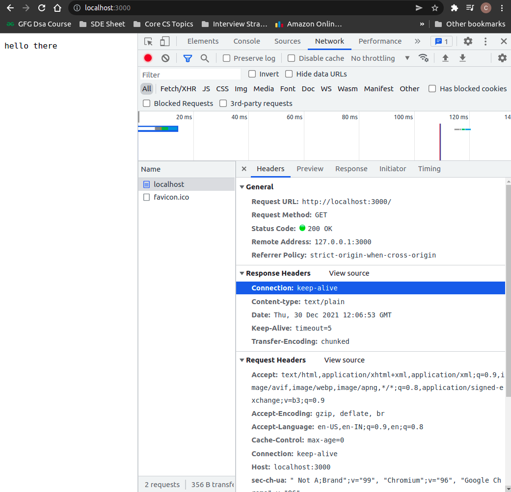
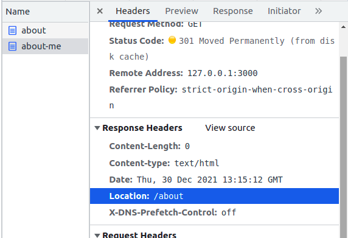
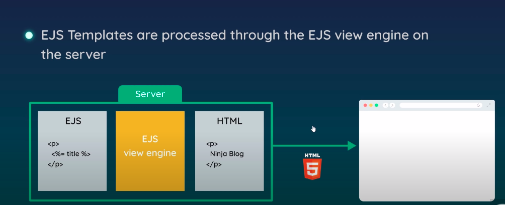

- [Introduction](#introduction)
  - [Running files](#running-files)
- [Nodejs basics](#nodejs-basics)
  - [Global object](#global-object)
  - [Modules & Require](#modules--require)
  - [Core Modules](#core-modules)
    - [OS](#os)
    - [File system](#file-system)
      - [Reading Files](#reading-files)
      - [Writing files](#writing-files)
      - [Directories](#directories)
      - [Deleting files](#deleting-files)
    - [Streams & Buffer](#streams--buffer)
      - [ReadStream](#readstream)
      - [WriteStream](#writestream)
      - [Piping](#piping)
- [Client & Servers](#client--servers)
- [Requests & Responses](#requests--responses)
  - [Request Object](#request-object)
  - [Response Object](#response-object)
    - [Basic Routing](#basic-routing)
    - [Status Codes](#status-codes)
    - [Redirecting to another page](#redirecting-to-another-page)
- [NPM](#npm)
- [Express](#express)
  - [Creating a basic server](#creating-a-basic-server)
  - [Routes and sending html pages](#routes-and-sending-html-pages)
  - [Redirects & 404 pages](#redirects--404-pages)
- [View Engines](#view-engines)
  - [Passing data into views](#passing-data-into-views)
  - [Partials](#partials)

# Introduction

- Node allows us to run javascript code on to the server/directly on computers using the V8 engine.
- Adds more feature to the normal javascript as well.
- But also lose normal JS features like DOM etc.( not really needed on the server )
  

## Running files

```bash
node filename.js
```

# Nodejs basics

## Global object

- Inside the browser `window` is the global object
- In node the global object is `global` which does not represent the browser.
- No need to specify the global object

```javascript
console.log(__dirname); // will output the current directory
console.log(__filename); // will output the current filename
```

- Normal window methods like document etc don't work

## Modules & Require

- When we `require` a file node will look for that file and then also run it as well.

```javascript
// File
const people = ["a", "b", "c", "d"];
console.log(people);
```

- Running main file will log the people array.

```javascript
// Main file
const xyz = require("./file");
```

- `xyz` here is an empty object and we don't have direct access to the people array inside the main file
- require will only run the file
- In order to export var we can use `module.exports` which will give value to `xyz`

```javascript
// File
const people = ["a", "b", "c", "d"];
console.log(people);

module.exports = "hello";
// xyz in the main file will get this value
```

- Can export multiple as well using a object
- Better to use destrucutre syntax

```javascript
// Main file
const { people, ages } = require("./file");
// can directyle access people and ages now
```

## Core Modules

### OS

- Refers to the operating system

```javascript
const os = require("os");
```

- Useful methods

```javascript
os.platform(); // current os
os.homedir(); // user home directory
```

### File system

#### Reading Files

- Async function requires a callback
- `readFile`

```javascript
const fs = require("fs");
fs.readFile("./docs/blog.txt", (err, data) => {
  if (err) {
    console.log(err);
  }
  console.log(data); // gives a buffer
  console.log(data.toString()); // will convert data to string
});
```

#### Writing files

- Async
- `writeFile`

```javascript
// path,content,callback
fs.writeFile("./docs/blog.txt", "hello world", () => {
  console.log("file was written");
});
```

- Will create file if does not exist

```javascript
fs.writeFile("./docs/blog2.txt", "hello again", () => {
  console.log("file was created and then written");
});
```

#### Directories

- Async
- `mkdir` & `rmdir`
- `existsSync` is synchronous (will stop the code)

```javascript
if (!fs.existsSync("./assets")) {
  // will only run if does not exist since mkdir gives error if already exists
  fs.mkdir("./assets", (err) => {
    if (err) {
      console.log(err);
    }
    console.log("created");
  });
} else {
  // if exists delete it
  fs.rmdir("./assets", (err) => {
    if (err) {
      console.log(error);
    }
    console.log("deleted");
  });
}
```

#### Deleting files

- Async
- `unlink`

```javascript
// only if exists
if (fs.existsSync("./docs/deleteme.txt")) {
  fs.unlink("./docs/deleteme.txt", (err) => {
    if (err) {
      console.log(err);
    }
    console.log("deleted");
  });
}
```

### Streams & Buffer

- When there is a large file we could wait and just read it first and do something with it later
- But could also use a stream of data by which we can start using the data before it has fully loaded
- The data gets send in small packets known as `buffer` through the `stream` so everytime we get a new chunk of data from the source we can start using it
- ex. streaming netflix ( the whole video is not send at a single time and only some of it is send)

#### ReadStream

- Read from a file
- readStream is kind of like a event handler like in front end js
- consider data to be an event
- everytime we get a new chunk of data we fire the callback

```javascript
// filelocation,(optional) encoding we want the data to be in otherwise buffer
const readStream = fs.createReadStream("./docs/largefile.txt", {
  encoding: "utf-8",
});

readStream.on("data", (chunk) => {
  console.log("----- NEW CHUNK -----");
  console.log(chunk);
});
```

#### WriteStream

- Write it to a file
- ex.

```javascript
const writeStream = fs.createWriteStream("./docs/blog4.txt");
readStream.on("data", (chunk) => {
  // everytime we get a new chunk write it to a new file blog4.txt
  writeStream.write("\nNEW CHUNK\n");
  writeStream.write(chunk);
});
```

#### Piping

- Does the same thing but needs to be from a readStream to a writeStream

```javascript
readStream.pipe(writeStream);
```

# Client & Servers

- Client and server use the `HTTP`(Hyper Text Transfer Protocol) construct to communicate with each other.

```javascript
const http = require("http");

// create server
const server = http.createServer((req, res) => {
  // whenever server is called this will run
  console.log("request made");
});

// listen to server requests on port 3000
// localhost connects to your own computer ip address (127.0.0.1)
// when we go to localhost:3000 it will log it out
server.listen(3000, "localhost", () => {
  console.log("listening for requests on port 3000");
});
```

# Requests & Responses

## Request Object

```javascript
const http = require("http");

const server = http.createServer((req, res) => {
  // req object contains
  // headers of the request
  // url
  // expected response types
  // etc.
  // console.log(req);
  console.log(req.url); // if on localhost will give '/'
  // will give whatever after localhost
  // can be useful to implement routing
  console.log(req.method); // GET
});

server.listen(3000, "localhost", () => {
  console.log("listening for requests on port 3000");
});
```

## Response Object

- Sending plain text as response

```javascript
const http = require("http");

const server = http.createServer((req, res) => {
  // set header content type for the reponse
  res.setHeader("Content-type", "text/plain");
  // write what response we want to send back
  res.write("hello there");
  // end the response
  res.end();
});

server.listen(3000, "localhost", () => {
  console.log("listening for requests on port 3000");
});
```

- This is the response recieved by the browser
  

- Sending html back

```javascript
const server = http.createServer((req, res) => {
  res.setHeader("Content-type", "text/html");

  // will re write existing head tag
  res.write('<head><link rel="stylesheet" href="#"');
  // this will go in the body
  res.write("<p>hello there</p>");
  res.write("<p>hello again, again</p>");

  res.end();
});
```

- A very bad way to send the html back
- Better is to create html in a seperate file and then send that file

```javascript
// inside createServer
// send an html file
fs.readFile("./views/index.html", (err, data) => {
  if (err) {
    console.log(err);
    res.end();
  } else {
    res.write(data);
    res.end();
  }
});
```

### Basic Routing

```javascript
const server = http.createServer((req, res) => {
  res.setHeader("Content-type", "text/html");

  // assume all html are stored in views folder
  let path = "./views/";

  // basic routing
  // req.url gives the current url after localhost
  switch (req.url) {
    case "/":
      path += "index.html";
      break;
    case "/about":
      path += "about.html";
      break;
    default:
      path += "404.html";
      break;
  }

  // reads file at path
  fs.readFile(path, (err, data) => {
    if (err) {
      console.log(err);
      res.end();
    } else {
      res.write(data);
      res.end();
    }
  });
});
```

### Status Codes

- Describe the type of response sent to the browser
- `200` -> OK
- `301` -> Resource Moved (permanent redirect to some other page)
- `404` -> Not found
- `500` -> Internal server error

```javascript
switch (req.url) {
  case "/":
    res.statusCode = 200;
    path += "index.html";
    break;
  case "/about":
    res.statusCode = 200;
    path += "about.html";
    break;
  default:
    res.statusCode = 404;
    path += "404.html";
    break;
}
```

### Redirecting to another page

- Ex. user goes on `/about-me` but that has been moved to `/about`.

```javascript
// same as above{
switch (req.url) {
  case "/":
    res.statusCode = 200;
    path += "index.html";
    break;
  case "/about":
    res.statusCode = 200;
    path += "about.html";
    break;
  case "/about-me":
    // will go to /about page and that again will send a request
    res.statusCode = 301;
    res.setHeader("Location", "/about");
    res.end();
    break;
  default:
    res.statusCode = 404;
    path += "404.html";
    break;
}
// }
```



# NPM

- NPM -> Node Package Manager
- Install nodemon globally to get live server reload

```
npm install -g nodemon
```

- To install other libraries/dependencies

```
npm install package_name
```

- To install all dependencies if no `node_modules` folder
- Will install all the dependecies present in `package.json` file

```
npm install
```

# Express

- Using Express makes writing node code much easier but everything can be done with only using node as well
- Install using

```
npm install express
```

## Creating a basic server

- `res.send()` is much better and is available to us in express which can set content type header for us based on the data and sets status codes as well

```javascript
const express = require("express");

// create express app
const app = express();

// listen for requests
// infers localhost
app.listen(3000);

// make a request
app.get("/", (req, res) => {
  // can do res.write but res.send is better
  // set content type header for us based on the data
  // sets status codes as well

  res.send("<p>Home page</p>");
});
```

## Routes and sending html pages

- To create routes create get requests rather than using switch case
- For sending html pages Need to specify whose root should the file path be
- First goes into current dir and then from there goes to the views folder

```javascript
app.get("/about", (req, res) => {
  // __dirname gives the current directory
  res.sendFile("./views/about.html", { root: __dirname });
});
```

## Redirects & 404 pages

```javascript
app.get("/about-me", (req, res) => {
  // will set headers automatically
  res.redirect("/about");
});
```

- For 404 pages
  - `app.use` will fire everytime a request is made if the code reaches till that point
  - It should be placed at the last
  - Also need to specify status code for this case specifically

```javascript
app.use((req, res) => {
  // will need to specify status code in case of this specifically
  res.status(404).sendFile("./views/404.html", { root: __dirname });
});
```

# View Engines

- Using view engine we can do dynamic templating
- Have html code we can change dynamically add loops,if checks etc.
- Using `ejs` view engine
- To tell the app we are using view engine

```javascript
// registers the view engine
app.set("view engine", "ejs");
```

- By default is going to look for a `views` folder but can change it

```javascript
app.set("views", "myviews");
```

- `ejs` files uses html syntax only and to send them as response we can `render the view`

```javascript
app.get("/", (req, res) => {
  res.render("index"); // no need to mention the extension
});
```

## Passing data into views

- To use dynamic enclose it within `<%` ex.
  - `<% const name = "hello" %>`
- To reference this

  - `<%= name %>`

- But mostly going to send something by the app and then update the value in the template

```javascript
// app.js
app.get("/", (req, res) => {
  res.render("index", { title: "some title" });
});
```

- Can access this title value in the index.ejs file now

```html
<!-- index.ejs -->
<%= title %>
```

- Can pass any kind of data

```javascript
app.get("/", (req, res) => {
  const blogs = [
    {
      title: "Title 1",
      snippet:
        "Lorem ipsum dolor sit amet consectetur adipisicing elit. Perspiciatis, commodi!",
    },
    {
      title: "Title 2",
      snippet:
        "Lorem ipsum dolor sit amet consectetur adipisicing elit. Perspiciatis, commodi!",
    },
  ];
  // blogs : blogs since blogs is same we can just leave it at blogs
  res.render("index", { title: "Home", blogs });
});
```

- To access it inside a ejs file

```
<div class="blogs content">
  <h2>All Blogs</h2>
  <% if(blogs.length> 0){ %>
  <% blogs.forEach(blog=> { %>
  <h3 class="title"><%= blog.title %></h3>
  <p class="snippet"><%= blog.snippet %></p>
  <% }) %>
  <% } else {%>
  <h3>No blogs to display</h3>
  <% } %>
</div>
```



## Partials

- A lot of files can have repeated content in the template like navbars, head, footers etc. which can be put into one file using `<%- include('filepath') %>`

- Define what want to use inside ejs file

```html
<!-- ex -->
<!-- nav.ejs -->
<!-- define inside partials folder -->
<nav>
  <div class="site-title">
    <a href="/">
      <h1>My Blog</h1>
    </a>
    <p>My Site</p>
  </div>
  <ul>
    <li><a href="/">Blogs</a></li>
    <li><a href="/about">About</a></li>
    <li><a href="/blogs/create">New Blogs</a></li>
  </ul>
</nav>
```

- Use it in another file

```html
<body>
  <!-- will include all the nav code in here -->
  <%- include('./partials/nav.ejs') %>
</body>
```
