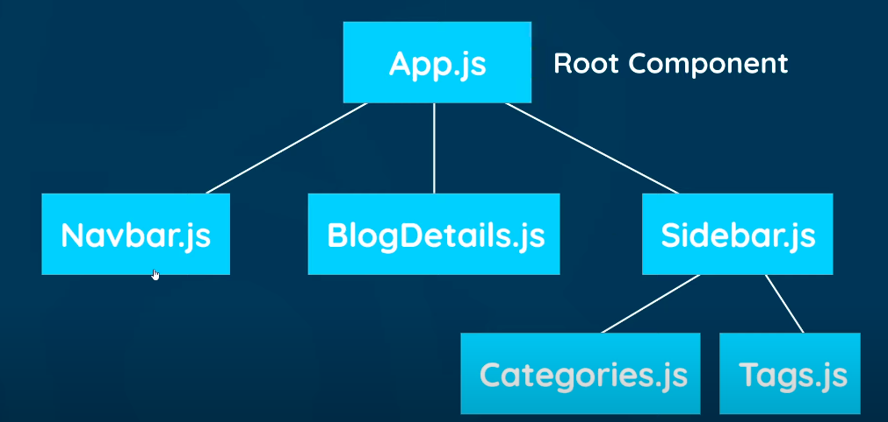

- [Introduction](#introduction)
- [Creating a React app](#creating-a-react-app)
- [Components](#components)
  - [Dynamic values](#dynamic-values)
  - [Multiple Components](#multiple-components)
  - [Styling Components](#styling-components)
    - [Inline styling](#inline-styling)
  - [Click Events](#click-events)
  - [State](#state)
  - [Outputting lists](#outputting-lists)
  - [Passing data to components using Props](#passing-data-to-components-using-props)
    - [Passing functions as props](#passing-functions-as-props)

# Introduction

- JS Library to create **Single Page Apps**(SPA)
  - SPA - only needs to send one initial request to the server.

# Creating a React app

```
npx create-react-app myapp
```

# Components

- Component contain :

  - Template for displaying
  - Logic

- Component written using `jsx`
- A normal template function name should be capital also need to export it to the index.js file.

```javascript
// app.js file
import "./App.css";

function App() {
  return (
    // this is all jsx and not html
    // can't use class here since it is reserved js keyword
    // babel on the backend side of the code converts all of this into visible html
    <div className="App">
      <div className="content">
        <h1>App Component</h1>
      </div>
    </div>
  );
}

export default App;
```

```javascript
// index.js
import React from "react";
import ReactDOM from "react-dom";
import "./index.css";
import App from "./App";

// render app component on the screen using React which gets added to the root div inside the html
ReactDOM.render(
  <React.StrictMode>
    <App />
  </React.StrictMode>,
  document.getElementById("root")
);
```

## Dynamic values

- Can output any value inside curly braces `{}` except for objects and boolean values.

```javascript
function App() {
  const title = "Welcome to the new blog";
  const link = "http://www.google.com";
  return (
    <div className="App">
      <div className="content">
        <h1>{title}</h1>
        <p>{[1, 2, 3, 4]}</p> {/*will convert this to a string*/}
        <a href={link}>Google</a>
      </div>
    </div>
  );
}
```

## Multiple Components



- Type `sfc` for the snippet to work for a stateless functional component
- Make sure to export component at the end.

```javascript
// NavBar.js
// this is a stateless functional component
const Navbar = () => {
  return (
    <nav className="navbar">
      <h1>The Dojo Blog</h1>
      <div className="links">
        <a href="/">Home</a>
        <a href="/create">New Blog</a>
      </div>
    </nav>
  );
};

export default Navbar;
```

- Can now add the Navbar component in the main App component

```javascript
import Navbar from "./Navbar";
import Home from "./Home";
// App.js
function App() {
  return (
    <div className="App">
      {/* use it this way */}
      <Navbar />
      <div className="content">
        <Home />
      </div>
    </div>
  );
}
```

## Styling Components

- When we import a css file to say the App component it will add that css to all the components nested inside the App component as well it does not get scoped.
- Any css file imported to the index.js file will apply to the entire project.
  - Can use styled components or css modules for scoping styles.
- For smaller apps it's better to add all the styles to the index.css file and import that to the index.js file

### Inline styling

- To do inline styling need to use double curly braces one to tell it is javascript and other for object itself

```javascript
<a href="/create" style={{
    color: "white",
    backgroundColor: "#f1356d",
    borderRadius: "8px",
  }}
>
```

## Click Events

- When assigning reference don't invoke the function since then it will just run

```javascript
const Home = () => {
  const handleClick = () => {
    console.log("hello there");
  };

  return (
    <div className="home">
      <h2>Home</h2>
      <button onClick={handleClick}>Click me</button>
    </div>
  );
};
```

- If want to pass value need to declare an anonymous function first which then calls the main function since anonymous function gets called when the event happens which in turn calls the main event function

```javascript
const Home = () => {
  const handleClick = (name) => {
    console.log(name));
  };

  return (
    <div className="home">
      <h2>Home</h2>
      <button onClick={() => handleClick('some name')}>Click me</button>
    </div>
  );
};
```

- The event object gets passed to the function automatically

```javascript
const Home = () => {
  const handleClick = (event) => {
    console.log(event);
  };

  return (
    <div className="home">
      <h2>Home</h2>
      <button onClick={handleClick}>Click me</button>
    </div>
  );
};
```

## State

- Some data that gets updated and we want react to re-render based on that change.
- Can use the `useState` hook which tells react to watch over the data so that the UI update when the data changes
- Use `setState` to set the value

```javascript
const Home = () => {
  // useState returns two things which we are getting by array destructuring
  // first should be the name of the variable and second is the setState function
  const [name, setName] = useState("chirag");
  const [age, setAge] = useState(25);

  const handleClick = () => {
    setName("changed name");
    setAge(20);
  };

  return (
    <div className="home">
      <h2>Home</h2>
      <p>
        {name} is {age} years old
      </p>
      <button onClick={handleClick}>Click me</button>
    </div>
  );
};
```

## Outputting lists

- Each value in the list needs to have a unique key property of its own so that react can differentiate b/w them

```javascript
import { useState } from "react";

const Home = () => {
  const [blogs, setBlogs] = useState([
    // the id's must be unique
    // when we store data on some server usually they have their own id
    {
      title: "My new website",
      body: "lorem ipsum ...",
      author: "person1",
      id: 1,
    },
    {
      title: "Title 2",
      body: "lorem ipsum ...",
      author: "person2",
      id: 2,
    },
    {
      title: "Title 3",
      body: "lorem ipsum ...",
      author: "person3",
      id: 3,
    },
  ]);

  return (
    <div className="home">
      {blogs.map((blog) => (
        // the key must be unique
        <div className="blog-preview" key={blog.id}>
          <h2>{blog.title}</h2>
          <p>Written by {blog.author}</p>
        </div>
      ))}
    </div>
  );
};

export default Home;
```

## Passing data to components using Props

- Can pass data to child components using props property

```javascript
// Child of some component
// BlogList.js

// can destructure it in the call itself
const BlogList = ({ blogs }) => {
  // const blogs = props.blogs;

  return (
    <div className="blog-list">
      {blogs.map((blog) => (
        // the key must be unique
        <div className="blog-preview" key={blog.id}>
          <h2>{blog.title}</h2>
          <p>Written by {blog.author}</p>
        </div>
      ))}
    </div>
  );
};

export default BlogList;
```

- Passed it using

```javascript
// parent component
return (
  <div className="home">
    {/*blogs will be available as a prop to the BlogList component*/}
    <BlogList blogs={blogs} />
  </div>
);
```

- Can use multiple components as well and pass them diff props

```javascript
return (
  <div className="home">
    <BlogList blogs={blogs} title="All Blogs" />
    <BlogList
      blogs={blogs.filter((blog) => blog.author === "person1")}
      title={"Person 1 Blogs"}
    />
  </div>
);
```

### Passing functions as props

- We can't access the original state in a child component through the props and the state will only be available in the parent component.
- Ex. say to delete something from the state we can declare the function in the parent component and pass that function reference as a prop to the child component which can call it using that reference

```javascript
// parent
const handleDelete = (id) => {
  const newBlogs = blogs.filter((blog) => blog.id !== id);
  setBlogs(newBlogs);
};

return (
  <div className="home">
    <BlogList blogs={blogs} title="All Blogs" handleDelete={handleDelete} />
  </div>
);
```

```javascript
// child
const BlogList = ({ blogs, title, handleDelete }) => {
  return (
    <div className="blog-list">
      <h2>{title}</h2>
      {blogs.map((blog) => (
        // the key must be unique
        <div className="blog-preview" key={blog.id}>
          <h2>{blog.title}</h2>
          <p>Written by {blog.author}</p>
          // IDHAR DEKH
          <button onClick={() => handleDelete(blog.id)}>Delete Blog</button>
        </div>
      ))}
    </div>
  );
};
```
