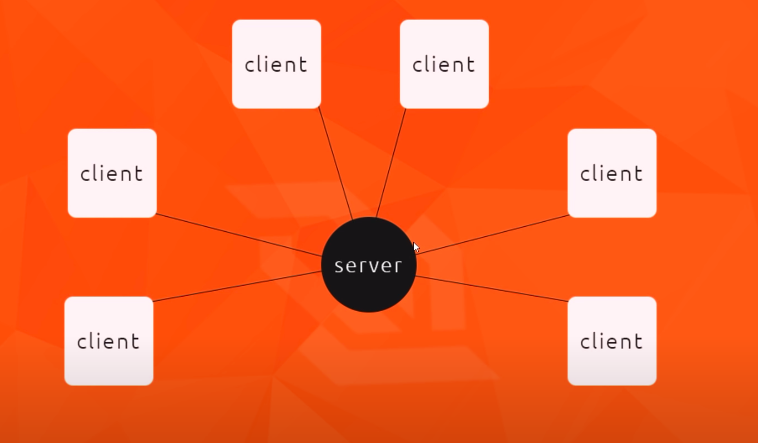
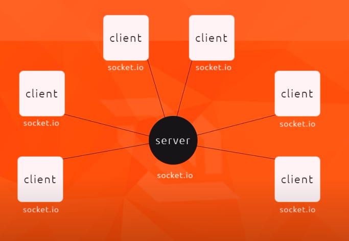

- [WebSockets](#websockets)
  - [Using Socket.io](#using-socketio)
  - [Emitting](#emitting)
  - [Broadcasting](#broadcasting)

# WebSockets

- Communication b/w a client(browser) and server
  - Which is biredctional ( data goes both ways from the client to server & server to client)
- Allows real time data flow
  

- A client updates the data ex. sends a message in a chatroom and that will be sent by the server back to the other clients instanly using websockets without making `ajax` requests by the client.

## Using Socket.io

- Create a simple backend server using express
- Install socketio on both the frontend(in html) & backend(node server)
- Backend using

```
npm install socket.io
```

- Backend connection

```javascript
// backend server file
const express = require("express");
const socket = require("socket.io");

// app & server setup
const app = express();
const server = app.listen(3000);

// static files
app.use(express.static("public"));

// Socket setup
const io = socket(server);
// make connection from server to front
// this function is called when the connection gets established
io.on("connection", (socket) => {
  console.log("made socket connection");
});
```

- Every socket will have its own unique id on connection

```javascript
io.on("connection", (socket) => {
  console.log("made socket connection", socket.id);
});
```

- In Frontend add cdn link to the html head
- Also need to make connection from the client to the server back

```javascript
// frontend js file connected to html using script tag
const socket = io.connect("http://localhost:3000");
```

## Emitting

- What we have done is basically when a client loads we will send the public pages back from the server and then setup socket on the server



- When a client will send some chat data the server will `emit` it to its other socket connections

```javascript
// frontend
// emit messages after submitting
sendBtn.addEventListener("click", () => {
  // this will emit the mesasage down the web socket after clicking on the submit button
  // (name of the data, data)
  socket.emit("chat", {
    message: messageInput.value,
    handle: handleInput.value,
  });
});
```

- This data will be recieved by the server socket which can then emit the data to all the other sockets/client connected.

```javascript
// backedn
// this function is called when the connection gets established
io.on("connection", (socket) => {
  console.log("made socket connection", socket.id);

  // when the particular socket recieves the data
  // this has the same name as the one we get from frontend
  socket.on("chat", (data) => {
    // refers to all the sockets connected to the browser
    // we are sending the chat data
    io.sockets.emit("chat", data);
  });
});
```

- After emiting from the backend the frontend clients can listen for these events using the `.on`

```javascript
// frontend
socket.on("chat", (data) => {
  outputWindow.innerHTML +=
    "<p><strong>" + data.handle + ":</strong>" + data.message + "</p>";
});
```

## Broadcasting

- What we did till now was to when client emits a message it goes to the server which was listening for it then the server emits back to all the sockets including the original one.
- Broadcasting does not send to the original socket

```javascript
// frontend client
// normal emit from here
messageInput.addEventListener("keypress", () => {
  socket.emit("typing", {
    handle: handleInput.value,
  });
});
```

- Inside our connection reciev data of type 'typing' and then broadcast it
- This is not send to all the sockets using broadcasting

```javascript
// backend
socket.on("typing", (data) => {
  // this message should not be emitted to all the sockets rather than get broadcasted to all the other sockets
  socket.broadcast.emit("typing", data);
});
```

- Listen for the typing data normally

```javascript
// frontend
socket.on("typing", (data) => {
  feedbackWindow.innerHTML = `<p><em>${data.handle}</em> is typing...</p>`;
});
```
